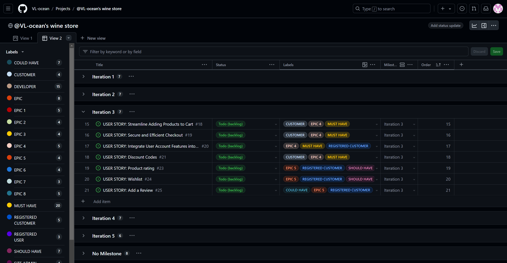
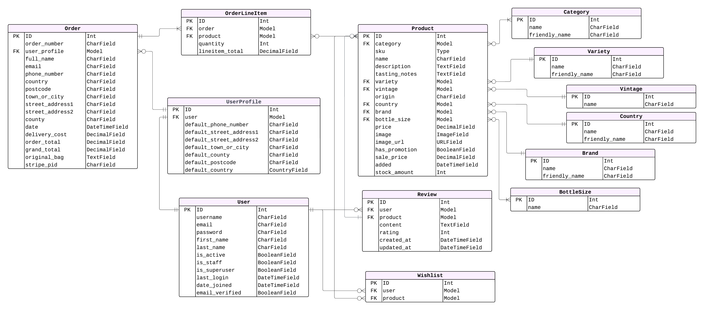

# WINERY [(*Live site*)]()

## Introduction 

. 

## Table of contents

- [WINERY (*Live site*)](#winery-live-site)
  - [Introduction](#introduction)
  - [Table of contents](#table-of-contents)
  - [Project Rationale](#project-rationale)
    - [Website Goals and Objectives](#website-goals-and-objectives)
    - [Target Audience](#target-audience)
  - [E-Commerce Business Model](#e-commerce-business-model)
  - [Marketing Strategies](#marketing-strategies)
    - [Search Engine Optimisation](#search-engine-optimisation)
    - [SEO Strategies Implemented](#seo-strategies-implemented)
    - [Social Media](#social-media)
    - [Newsletter Marketing](#newsletter-marketing)
  - [Agile Methodology](#agile-methodology)
    - [Overview](#overview)
    - [MoSCoW Prioritization](#moscow-prioritization)
    - [GitHub Projects](#github-projects)
    - [EPICs](#epics)
    - [User Stories](#user-stories)
      - [Developer](#developer)
      - [Site Visitor](#site-visitor)
      - [Registered User](#registered-user)
      - [Customer](#customer)
      - [Registered Customer](#registered-customer)
      - [Site Admin](#site-admin)
  - [UX/UI design](#uxui-design)
    - [Wireframe](#wireframe)
    - [Structure \& Logical Flow (database design)](#structure--logical-flow-database-design)
    - [Colour Scheme](#colour-scheme)
    - [Typography](#typography)
    - [Responsiveness](#responsiveness)
  - [Security Measures and Protective Design](#security-measures-and-protective-design)
    - [User Authentication](#user-authentication)
    - [Password Management](#password-management)
    - [Form Validation](#form-validation)
    - [Database Security](#database-security)
  - [Features](#features)
    - [Header](#header)
    - [Future Features](#future-features)
  - [Technologies Used](#technologies-used)
    - [Coding languages used](#coding-languages-used)
    - [Frameworks and Libraries used](#frameworks-and-libraries-used)
  - [Testing](#testing)
  - [Deployment](#deployment)
    - [AWS Cloud Service](#aws-cloud-service)
      - [**1. Create and Configure an S3 Bucket**](#1-create-and-configure-an-s3-bucket)
      - [**2. Configure IAM (Identity and Access Management):**](#2-configure-iam-identity-and-access-management)
      - [**3. Final AWS Setup and Heroku Integration:**](#3-final-aws-setup-and-heroku-integration)
    - [Stripe](#stripe)
      - [**Steps for Stripe Integration:**](#steps-for-stripe-integration)
      - [**Testing Stripe Payments:**](#testing-stripe-payments)
    - [GMAIL](#gmail)
      - [**Steps for Gmail Integration:**](#steps-for-gmail-integration)
      - [**Security and Compliance:**](#security-and-compliance)
    - [Deployment Process with Heroku](#deployment-process-with-heroku)
    - [To fork the project](#to-fork-the-project)
    - [To clone the project](#to-clone-the-project)
  - [Credits](#credits)
    - [Project Inspiration](#project-inspiration)
    - [Content](#content)
    - [Tutorials \& Codebase](#tutorials--codebase)
    - [Media](#media)
    - [Tools](#tools)
  - [Acknowledgements](#acknowledgements)

## Project Rationale

### Website Goals and Objectives

### Target Audience

[Back to top](#table-of-contents)

## E-Commerce Business Model

[Back to top](#table-of-contents)

## Marketing Strategies

### Search Engine Optimisation

### SEO Strategies Implemented

### Social Media

### Newsletter Marketing

[Back to top](#table-of-contents)

## Agile Methodology

### Overview

Agile methodology is a project management approach that emphasizes flexibility, collaboration, and iterative progress towards a well-defined goal. It is particularly effective in software development where requirements and solutions evolve through the collaborative effort of self-organizing cross-functional teams. Agile methodologies aim to deliver small, incremental changes in a product to improve quality and adaptability to changing needs.

### MoSCoW Prioritization

The MoSCoW prioritization technique is used to determine the importance of various features and tasks in a project. This method categorizes features into four groups: Must Have, Should Have, Could Have, and Won't Have. This helps in effective time management and ensures that the most critical functionalities are delivered first. The recommended percentage of items is no more than 60% in Must, 20% in Should, and 20% in Could.

### GitHub Projects

Using GitHub Projects, tasks are managed and progress tracked through project boards. Three middle boards represent status of the User Story (To Do, In Progress, Done). First board displays EPICs and the last board displays issues that were labled as WON'T HAVE and are due to implement in future, along with discovered bugs. Each user story issue has labels that show the user story persona, MoSCoW priority category, order, Epic and iteration (milestone) it belongs to. 

[Link to the project board](https://github.com/users/VL-ocean/projects/4/views/1) & [Link to the project table](https://github.com/users/VL-ocean/projects/4/views/2)

Iteration 1

<b>Table view at planning stage</b>
  

<b>Table view at mid-time iteration</b>
  

<b>Board view at mid-time iteration</b>
  

<b>Issue Sample #4</b>
  

Iteration 2

<b>Table view at planning stage</b>
  

<b>Table view at mid-time iteration</b>
  

<b>Board view at mid-time iteration</b>
  

<b>Issue Sample #</b>
  

Iteration 3

<b>Table view at planning stage</b>
  

<b>Table view at mid-time iteration</b>
  

<b>Board view at mid-time iteration</b>
  

<b>Issue Sample #</b>
  

Iteration 4

<b>Table view at planning stage</b>
  

<b>Table view at mid-time iteration</b>
  

<b>Board view at mid-time iteration</b>
  

<b>Issue Sample #</b>
  

Iteration 5

<b>Table view at planning stage</b>
  

<b>Table view at mid-time iteration</b>
  

<b>Board view at mid-time iteration</b>
  

<b>Issue Sample #</b>
  

### EPICs

Epic is a large body of work that is broken down into user stories. Each Epic in this project represents a key aspect of the platform's development and ensures comprehensive coverage of the required functionalities.

- [**EPIC 1: Project Planning**](https://github.com/VL-ocean/winery/issues/6)
    - [USER STORY: Agile Methodology](https://github.com/VL-ocean/winery/issues/1)
    - [USER STORY: Design Database Schema](https://github.com/VL-ocean/winery/issues/2)
    - [USER STORY: Design Website Visuals](https://github.com/VL-ocean/winery/issues/3)
    - [USER STORY: Create Wireframes](https://github.com/VL-ocean/winery/issues/4)
    - [USER STORY: Create Django Project](https://github.com/VL-ocean/winery/issues/5)

Summary: Covers the user experience design process and development environment setup

- [**EPIC 2: Registration and User Account Management**](https://github.com/VL-ocean/winery/issues/11)
    - [USER STORY: User Registration](https://github.com/VL-ocean/winery/issues/7)
    - [USER STORY: User Login and Logout Features](https://github.com/VL-ocean/winery/issues/8)
    - [USER STORY: Password Reset](https://github.com/VL-ocean/winery/issues/9)
    - [USER STORY: Profile Management](https://github.com/VL-ocean/winery/issues/10)

Summary: It encompasses user-related functionalities focusing on managing user accounts effectively within the system

- [**EPIC 3: Admin and Store Management**](https://github.com/VL-ocean/winery/issues/16)
   - [USER STORY: Add Products to the Store](https://github.com/VL-ocean/winery/issues/12)
   - [USER STORY: Update Product Details in the Store](https://github.com/VL-ocean/winery/issues/13)
   - [USER STORY: Delete Products from the Store](https://github.com/VL-ocean/winery/issues/14)
   - [USER STORY: Administration Content CRUD](https://github.com/VL-ocean/winery/issues/15)

Summary: The goal is to streamline the process of adding, editing and displaying products, allowing admins to efficiently manage the store's inventory and ensure accurate and up-to-date information for customers

- [**EPIC 4: Seamless Checkout Experience**](https://github.com/VL-ocean/winery/issues/22)
   - [USER STORY: Simplify Product Selection](https://github.com/VL-ocean/winery/issues/17)
   - [USER STORY: Streamline Adding Products to Cart](https://github.com/VL-ocean/winery/issues/18)
   - [USER STORY: Secure and Efficient Checkout](https://github.com/VL-ocean/winery/issues/19)
   - [USER STORY: Integrate User Account Features into the Checkout Process](https://github.com/VL-ocean/winery/issues/20)
   - [USER STORY: Discount Codes](https://github.com/VL-ocean/winery/issues/21)

Summary: This epic encompasses a range of features and improvements designed to streamline product selection, simplify the addition of items to the cart, ensure secure payment processing, and facilitate a seamless purchase completion. The aim is to make the shopping and checkout experience both convenient and user-friendly

- [**EPIC 5: User Engagement**](https://github.com/VL-ocean/winery/issues/27)
  - [USER STORY: Product rating](https://github.com/VL-ocean/winery/issues/23)
  - [USER STORY: Wishlist](https://github.com/VL-ocean/winery/issues/24)
  - [USER STORY: Add a Review](https://github.com/VL-ocean/winery/issues/25)
  - [USER STORY: Manage Reviews](https://github.com/VL-ocean/winery/issues/26)

Summary: Registered user content management

- [**EPIC 6: User Experience Optimization**](https://github.com/VL-ocean/winery/issues/32)
  - [USER STORY: Implement Navigation Experience](https://github.com/VL-ocean/winery/issues/28)
  - [USER STORY: Visual Consistency](https://github.com/VL-ocean/winery/issues/29)
  - [USER STORY: Accessibility Enhancement](https://github.com/VL-ocean/winery/issues/30)
  - [USER STORY: Performance Optimization](https://github.com/VL-ocean/winery/issues/31)

Summary: The epic aims to optimize the user experience and interface design of the platform to maximize user satisfaction, engagement, and usability

- [**EPIC 7: SEO & Marketing**](https://github.com/VL-ocean/winery/issues/36)
  - [USER STORY: Facebook Marketing](https://github.com/VL-ocean/winery/issues/33)
  - [ USER STORY: SEO](https://github.com/VL-ocean/winery/issues/34)
  - [USER STORY: Newsletter Subscription](https://github.com/VL-ocean/winery/issues/35)

Summary: This epic focuses on optimizing the website's search engine visibility and enhancing marketing efforts to increase traffic and engagement

- [**EPIC 8: Quality Assurance and Documentation**](https://github.com/VL-ocean/winery/issues/42)
  - [USER STORY: Code Validation](https://github.com/VL-ocean/winery/issues/37)
  - [USER STORY: Performance and Accessibility Testing](https://github.com/VL-ocean/winery/issues/38)
  - [USER STORY: User Story Testing](https://github.com/VL-ocean/winery/issues/39)
  - [USER STORY: Heroku Deployment](https://github.com/VL-ocean/winery/issues/40)
  - [USER STORY: Comprehensive Project Documentation](https://github.com/VL-ocean/winery/issues/41)

Summary: Testing and validation are necessary to ensure the quality and reliability of the project

### User Stories

With an emphasis on delivering a seamless user experience, the goal of this project is to provide a comprehensive platform that serves all users. The platform will allow for the development and maintenance of content, and provide opportunities for interaction. The following user stories outline the essential functionalities and the rationale behind them.

#### Developer

- As a Developer I want to use Agile so that I can deliver high quality product that meets the user needs [( _link_ )](https://github.com/VL-ocean/winery/issues/1)
- As a Developer I want to design a database schema so that I can efficiently store and manage platform content, ensuring optimal performance, scalability, and flexibility [( _link_ )](https://github.com/VL-ocean/winery/issues/2)
- As a Developer I want to create visually engaging and responsive designs so that users can easily navigate the website and access relevant information [( _link_ )](https://github.com/VL-ocean/winery/issues/3)
- As a Developer I want to create wireframes so that I can visually represent the layout and structure of the application [( _link_ )](https://github.com/VL-ocean/winery/issues/4)
- As a Developer I want to install and add basic configurations to Django so that I can create a working application [( _link_ )](https://github.com/VL-ocean/winery/issues/5)
- As a Developer I want to ensure consistent visual elements across the platform so that users can have a cohesive and pleasant user interface experience [( _link_ )](https://github.com/VL-ocean/winery/issues/29)
- As a Developer I want to improve accessibility features so that all users have equal access to the website features, including those with disabilities [( _link_ )](https://github.com/VL-ocean/winery/issues/30)
- As a Developer I want to improve the platform load speed and response to user interactions so that users can have a seamless experience [( _link_ )](https://github.com/VL-ocean/winery/issues/31)
- As a Developer I want to be able to share the business on Facebook so that I can reach and market to a larger audience [( _link_ )](https://github.com/VL-ocean/winery/issues/33)
- As a Developer I want to improve the website's search engine optimization (SEO) so that the website can rank higher in search engine results and attract more traffic [( _link_ )](https://github.com/VL-ocean/winery/issues/34)
- As a Developer I want to ensure that all syntax errors are identified and resolved during the code validation process so that the code is free from syntax-related issues [( _link_ )](https://github.com/VL-ocean/winery/issues/37)
- As a Developer I want to ensure that application meets performance and accessibility standards so that it provides a seamless experience for all users and performs optimally [( _link_ )](https://github.com/VL-ocean/winery/issues/38)
- As a Developer I want to ensure that user stories are thoroughly tested so that the acceptance criteria are met and the application delivers the expected functionality [( _link_ )](https://github.com/VL-ocean/winery/issues/39)
- As a Developer I want to deploy the application to Heroku so that it is accessible to users online [( _link_ )](https://github.com/VL-ocean/winery/issues/40)
- As a Developer I want to maintain thorough documentation so that the code can be maintained seamlessly in future [( _link_ )](https://github.com/VL-ocean/winery/issues/41)

#### Site Visitor

- As a Site Visitor I want to be able to register an account so that I can create an account and access the features of a registered user [( _link_ )](https://github.com/VL-ocean/winery/issues/7)
- As a Site Visitor I want to be able to navigate through the platform effortlessly so that I can find relevant sections and features intuitively [( _link_ )](https://github.com/VL-ocean/winery/issues/28)
- As a Site Visitor I want to be able to subscribe to a newsletter so that I can receive updates, promotions, and valuable content directly to my inbox [( _link_ )](https://github.com/VL-ocean/winery/issues/35)

#### Registered User

- As a Registered User I want to be able to log in and out of my account so that I can access my personal account information [( _link_ )](https://github.com/VL-ocean/winery/issues/8)
- As a Registered User I want to be able to recover my password in case I forgot it so that I can recover access to my account [( _link_ )](https://github.com/VL-ocean/winery/issues/9)
- As a Registered User I want to have a personalized profile so that I can manage my profile information [( _link_ )](https://github.com/VL-ocean/winery/issues/10)

#### Customer

- As a Customer I want to be able to select products in an intuitive and efficient way so that I can easily find and choose the items I want to purchase [( _link_ )](https://github.com/VL-ocean/winery/issues/17)
- As a Customer I want to be able to add products to my cart quickly and easily so that I can efficiently manage my selected items before proceeding to checkout [( _link_ )](https://github.com/VL-ocean/winery/issues/18)
- As a Customer I want to have a secure and efficient checkout process so that I can complete my purchase confidently and without unnecessary delays [( _link_ )](https://github.com/VL-ocean/winery/issues/19)
- As a Customer I want to be able to apply discount codes during checkout so that I can receive a discount on my purchase [( _link_ )](https://github.com/VL-ocean/winery/issues/21)

#### Registered Customer

- As a Registered Customer I want my account information to be seamlessly integrated into the purchasing and checkout process so that I can enjoy a personalized and efficient shopping experience [( _link_ )](https://github.com/VL-ocean/winery/issues/20)
- As a Registered Customer I want to be able to rate a product so that I can express my opinion [( _link_ )](https://github.com/VL-ocean/winery/issues/23)
- As a Registered Customer I want to be able to add product to my wishlist so that I may keep an eye on its price and purchase it at a later date [( _link_ )](https://github.com/VL-ocean/winery/issues/24)
- As a Registered Customer I want to be able to comment on products so that I can provide feedback [( _link_ )](https://github.com/VL-ocean/winery/issues/25)
- As a Registered Customer I want to be able to delete and edit reviews so that I can control my engagement on the platform [( _link_ )](https://github.com/VL-ocean/winery/issues/26)

#### Site Admin

- As a Site Admin I want to be able to add new products to my store so that I can keep my inventory up-to-date [( _link_ )](https://github.com/VL-ocean/winery/issues/12)
- As a Site Admin I want to be able to update product details, including prices, descriptions, images, and other attributes so that I can ensure that product information remains accurate and relevant on the store's website [( _link_ )](https://github.com/VL-ocean/winery/issues/13)
- As a Site Admin I want to be able to remove products from the store so that the inventory is relevant and any outdated or discontinued items are eliminated [( _link_ )](https://github.com/VL-ocean/winery/issues/14)
- As a Site Admin I want to be able to perform all CRUD (Create, Read, Update, Delete) operations so that I can manually manage, control and edit content [( _link_ )](https://github.com/VL-ocean/winery/issues/15)

[Back to top](#table-of-contents)

## UX/UI design

### Wireframe

The wireframes provide a visual representation of the layout and structure of the application. They outline the placement of key elements such as navigation menus, user profiles, content areas, and interactive features. The wireframes ensure a cohesive and intuitive user interface, guiding the design and development process. After the extensive testing was conducted, naturally there are some deviations from wireframes in the live version of the platform.

Tool: Balsamiq  
Format: PDF 

- [All Wireframes](./README-media/wireframes/winestore.pdf)
- [Base Template](./README-media/wireframes/base-template.pdf)
- [Home page](./README-media/wireframes/home.pdf)
- [About Us](./README-media/wireframes/about-us.pdf)
- [Contact Us](./README-media/wireframes/contact-us.pdf)
- [Shop Wine](./README-media/wireframes/shop-wine.pdf)
- [Promotions](./README-media/wireframes/promotions.pdf)
- [Product View](./README-media/wireframes/product-view.pdf)
- [Shopping Cart](./README-media/wireframes/cart.pdf)

### Structure & Logical Flow (database design)

The database schema describes the structure and relationships between the key tables of the platform. The User table stores basic user information and authentication data. The UserProfile table stores the default address, which allows the site to pre-populate the order delivery address for the user. The Order table stores all order details. The OrderLineItem table stores information about each bag line and makes it easy to calculate the total order value at checkout. The Product table stores all product information. It connects to several smaller tables such as Category, Variety, Vintage, Country, Brand, BottleSize. The Review table stores product reviews and ratings. Wishlist table stores the user's favourite products. The Coupon table stores the necessary information about the coupon and whether it has been used.

The database model diagram was designed using Lucidchart:

### Colour Scheme

The colours were mostly taken from bootstrap colour palette. They are:
- `#212529` - text colour 

Custom colours:
- `#e99767` - border accent colour 

### Typography

- **Rubik** was chosen as the primary font. Rubik is a sans serif font family with slightly rounded corners. It is a 5 weight family with Roman and Italic styles, that accompanies Rubik Mono One, a monospaced variation of the Black roman design. Rubik provides a friendly and approachable appearance while maintaining excellent readability on both screens and printed materials.

- **Alegreya Sans SC** was chosen as the primary title font. Alegreya Sans SC is a Small Caps companion family to Alegreya Sans, a humanist sans serif family with a calligraphic feeling that conveys a dynamic and varied rhythm. This gives a pleasant feeling to readers of long texts. The Alegreya type system is a "super family", originally intended for literature, and includes sans and serif sibling families. The family follows humanist proportions and principles, and achieves a ludic and harmonious paragraph through elements carefully designed in an atmosphere of diversity. The italics bring a strong emphasis to the roman styles.

- **Nunito** was chosen as the subtitle font. It is a well balanced sans serif typeface superfamily. Nunito was created as a rounded terminal sans serif for display typography.

### Responsiveness

The website is responsive to different layouts depending on the size of the viewport based on the Bootstrap media queries.

[Back to top](#table-of-contents)

## Security Measures and Protective Design

### User Authentication

- Django's LoginRequiredMixin is used to ensure that any requests to access secure pages by non-authenticated users are redirected to the login page.
- Django's UserPassesTestMixin is used to limit access based on certain permissions, ensuring users can only edit/delete content they authored. If the user doesn't pass the test, they are shown an HTTP 403 Forbidden error.

### Password Management

- Use Django's built-in password management tools to ensure passwords are hashed and stored securely.
- Enforce strong password policies to enhance user account security.

### Form Validation

- If incorrect or empty data is added to a form, the form won't submit, and a warning will appear to the user informing them which field raised the error.

### Database Security

- The database URL and secret key are stored in the env.py file to prevent unwanted connections to the database. This setup was implemented before the first push to GitHub.
- Cross-Site Request Forgery (CSRF) tokens are used on all forms throughout the site to enhance security.

[Back to top](#table-of-contents)

## Features

### Header

*Visitor view*

*User View*

The header 

### Future Features

- 

[Back to top](#table-of-contents)

## Technologies Used

### Coding languages used

* HTML
* CSS
* Python
* JavaScript

### Frameworks and Libraries used

**Django**
* Framework used to build this project. Provides a built in admin panel and includes many helper template tags that make writing code quick and efficient.

**Django-Allauth**
* Used for User authenticaion (register, login and logout).

**Django Crispy Forms**
* Used to control rendering of Django forms.

**PostgreSQL**
* The database used by the deployed project on Heroku.
  
**psycopg2**
* PostgreSQL database adapter for the Python programming language.

**Gunicorn**
* Python HTTP server for WSGI applications.

**WhiteNoise**
* Designed to serve static files for Django applications.

**Django RichTextField**
* A Django model field and widget that renders a customizable rich text/WYSIWYG widget.

**Django Resized**
* Resizes image origin to specified size.

**Cloudinary**
* The cloud platform used to store static media files.

**Balsamic**
* Used for the wireframes

**Git**
* Used for version control.

**GitHub**
* Used to store the project's code after being pushed from Git.

**GitPod**
* Used as a platform to develop code in a ready-to-code developer environment.

**Heroku**
* The cloud platform used to deploy the project in the live environment.

**Bootstrap**
* The front end development framework used for styling along with custom CSS.
  
**Lucidchart**
* Used for the entity relationship diagram

[Back to top](#table-of-contents)

## Testing

The website underwent an extensive testing process to ensure its functionality, accessibility, and performance. This involved validating the code, assessing accessibility, conducting performance tests, performing cross-device testing, verifying browser compatibility, evaluating user stories, and incorporating user feedback to improve the overall user experience. 

Testing summary and results can be found in [TESTING.md](TESTING.md) file.

[Back to top](#table-of-contents)

## Deployment

### AWS Cloud Service

Teacup Tales uses Amazon Web Services (AWS) to store static and media files securely in the cloud, ensuring fast and reliable access for our users.

**To integrate AWS, follow steps:**

#### **1. Create and Configure an S3 Bucket**

1.  **Access AWS:**
    
    -   Go to [aws.amazon.com](https://aws.amazon.com/) and log in to your AWS Management Console.
2.  **Create an S3 Bucket:**
    
    -   Search for "S3" in the AWS Management Console and create a new bucket.
    -   Name the bucket to match your Heroku app name and select the region closest to your target audience.
3.  **Set Public Access and Ownership:**
    
    -   Uncheck the "Block all public access" option and acknowledge that the bucket will be public (required for compatibility with Heroku).
    -   Under "Object Ownership," ensure "ACLs enabled" and "Bucket owner preferred" are selected.
4.  **Enable Static Website Hosting:**
    
    -   In the "Properties" tab, enable static website hosting.
    -   Set `index.html` as the index document and `error.html` as the error document, then click "Save."
5.  **Configure CORS (Cross-Origin Resource Sharing):**
    
    -   In the "Permissions" tab, add the following CORS configuration:
    
    json
    
    Copy code
    
    `[
      {
        "AllowedHeaders": ["Authorization"],
        "AllowedMethods": ["GET"],
        "AllowedOrigins": ["*"],
        "ExposeHeaders": []
      }
    ]` 
    
    -   Copy your bucket's **ARN** (Amazon Resource Name).
6.  **Add a Bucket Policy:**
    
    -   Go to the "Bucket Policy" tab and click on the "Policy Generator" link.
    -   Configure the policy:
        -   **Policy Type:** S3 Bucket Policy
        -   **Effect:** Allow
        -   **Principal:** *
        -   **Actions:** `s3:GetObject`
        -   **ARN:** Paste your bucket's ARN
    -   Click "Add Statement" and "Generate Policy."
    -   Copy the generated policy and paste it into the "Bucket Policy Editor":
    
    json
    
    Copy code
    
    `{
      "Version": "2012-10-17",
      "Statement": [
        {
          "Effect": "Allow",
          "Principal": "*",
          "Action": "s3:GetObject",
          "Resource": "arn:aws:s3:::your-bucket-name/*"
        }
      ]
    }` 
    
    -   Ensure the `Resource` field ends with `/*` and click "Save."
7.  **Adjust Access Control List (ACL):**
    
    -   In the "Access Control List" (ACL) section, click "Edit" and enable "List" for Everyone (public access). Accept the warning prompt.
    -   If the edit option is disabled, ensure the "Object Ownership" settings have ACLs enabled.

#### **2. Configure IAM (Identity and Access Management):**

1.  **Create a User Group:**
    
    -   Navigate to the IAM service and select "User Groups."
    -   Click "Create New Group," and name it appropriately (e.g., `group-teacup-tales`).
2.  **Attach Policies to the Group:**
    
    -   Select the newly created group and go to the "Permissions" tab.
    -   Click "Add Permissions" > "Attach Policies."
    -   In the "JSON" tab, click "Import Managed Policy" and search for `AmazonS3FullAccess`.
    -   Import the policy and modify it to limit access to your specific bucket:
    
    json
    
    Copy code
    
    `{
      "Version": "2012-10-17",
      "Statement": [
        {
          "Effect": "Allow",
          "Action": "s3:*",
          "Resource": [
            "arn:aws:s3:::your-bucket-name",
            "arn:aws:s3:::your-bucket-name/*"
          ]
        }
      ]
    }` 
    
    -   Click "Review Policy" and name it (e.g., `policy-teacup-tales`), then click "Create Policy."
3.  **Add Users and Assign Permissions:**
    
    -   Go back to "User Groups," select your group, and click "Attach Policy."
    -   Select your custom policy (e.g., `policy-teacup-tales`) and attach it.
    -   Click "Add User" and name it appropriately (e.g., `user-teacup-tales`).
    -   Select "Programmatic Access" and add the user to your group.
    -   Download the CSV file containing the `AWS_ACCESS_KEY_ID` and `AWS_SECRET_ACCESS_KEY`.

#### **3. Final AWS Setup and Heroku Integration:**

1.  **Update Heroku Configurations:**
    
    -   Remove `DISABLE_COLLECTSTATIC` from Heroku Config Vars to enable AWS management of static files.
2.  **Create Media Directory:**
    
    -   Within your S3 bucket, create a new folder named `media`.
    -   Upload your media files into this folder and set "Public read access."
3.  **Security Reminder:**
    
    -   Ensure all sensitive information (like AWS credentials) is securely stored and not hard-coded into your source code.

----------

***Summary***

These steps integrate AWS S3 with your Heroku-hosted application, enabling efficient management of static and media files in a secure and scalable cloud environment. Proper configuration ensures that your content is readily accessible while adhering to best practices in cloud security and management.

### Stripe

Teacup Tales utilizes Stripe as its primary payment gateway to securely process e-commerce transactions. Stripe provides a reliable and scalable solution for handling payments, ensuring a seamless checkout experience for our customers.

#### **Steps for Stripe Integration:**

1.  **Create a Stripe Account:**
    
    -   Go to [stripe.com](https://stripe.com) and create an account. Log in to your Stripe dashboard.
2.  **Obtain API Keys:**
    
    -   From your Stripe dashboard, locate the "API Keys" section under "Developers."
    -   Retrieve the following keys:
        -   **STRIPE_PUBLIC_KEY**: Your Publishable Key (starts with `pk`)
        -   **STRIPE_SECRET_KEY**: Your Secret Key (starts with `sk`)
    -   These keys will be used to authenticate your application with Stripe.
3.  **Configure Webhooks for Payment Events:**
    
    -   To handle scenarios where a user may close the payment page prematurely, set up Stripe Webhooks to receive real-time payment updates.
    -   In your Stripe dashboard:
        -   Navigate to "Developers" and select "Webhooks."
        -   Click "Add Endpoint."
        -   Enter your endpoint URL (e.g., `https://wine-shop.herokuapp.com/checkout/wh/`).
        -   Select "Receive all events" to capture all relevant payment events.
        -   Click "Add Endpoint" to complete the process.
    -   This will generate a new key:
        -   **STRIPE_WH_SECRET**: Your Webhook Signing Secret (starts with `wh`).

#### **Testing Stripe Payments:**

1.  **Test Mode:**
    
    -   Stripe provides a test mode to simulate payment transactions.
    -   Use the following test card details for interactive testing:
        -   **Card Number:** `4242 4242 4242 4242`
        -   **Expiry Date:** Any valid future date (e.g., `12/34`)
        -   **CVC:** Any three-digit number (or four digits for American Express)
        -   **Other Fields:** Use any value for other fields.
2.  **Security Reminder:**
    
    -   Ensure all Stripe API keys and Webhook Signing Secrets are stored securely, and never hard-code them in your source code.

----------

***Summary:***

By integrating Stripe with Teacup Tales, we provide a secure and user-friendly payment solution. This setup will handle all e-commerce transactions, improve the user experience, and offer flexibility in managing payment events and ensuring payment security.

### GMAIL 

Teacup Tales uses Gmail to manage email communications with users, including account verifications and purchase order confirmations. Integrating Gmail ensures reliable and secure delivery of transactional emails to enhance the customer experience.

#### **Steps for Gmail Integration:**

1.  **Create and Access Gmail Account:**
    
    -   Ensure you have an active Gmail (Google) account. Log in to your account.
2.  **Enable Two-Factor Authentication (2FA):**
    
    -   Go to your Google Account by clicking on your profile icon in the top-right corner and selecting "Manage Your Google Account."
    -   Navigate to the **Security** tab on the left sidebar.
    -   Under the "Signing in to Google" section, enable **2-Step Verification**. Follow the prompts to verify your password and activate 2FA.
3.  **Generate an App Password:**
    
    -   After enabling 2FA, stay on the **Security** page and select **App passwords**.
    -   Re-enter your password if prompted.
    -   Choose **Mail** as the app type and select **Other (Custom name)** for the device type. Enter a relevant name (e.g., "Teacup Tales Django App").
    -   Click **Generate** to create a 16-character app password (API key). **Note:** This password will only be displayed once, so save it securely.
4.  **Configure Email Settings in Your Application:**
    
    -   Update your application's email settings with the following credentials:
        -   **EMAIL_HOST_USER**: Your Gmail address (e.g., `your-email@gmail.com`)
        -   **EMAIL_HOST_PASSWORD**: The 16-character app password generated from Gmail.

#### **Security and Compliance:**

-   Ensure that your Gmail credentials, especially the app password, are stored securely and not hard-coded in your source code. Consider using environment variables or a secure secrets manager for this purpose.

----------

***Summary:***

By integrating Gmail, Teacup Tales can send secure and reliable emails for account verifications and purchase confirmations, enhancing communication with users and supporting overall customer engagement and satisfaction

### Deployment Process with Heroku

1.  Navigate to the [Heroku website](https://www.heroku.com/) and either [log in](https://id.heroku.com/login) to your existing account or [sign up](https://signup.heroku.com/) for a new account.
2.  From the dashboard, click the "New" button in the upper right corner and select "Create new App" from the drop-down menu.
3.  Provide a unique name for your application in the "App name" field.
    -   Heroku will indicate the name's availability with a green checkmark.
4.  Select the appropriate region ("United States" or "Europe") from the "Choose a region" dropdown, based on your target user base.
5.  Click the "Create app" button to proceed.
6.  On the next screen, navigate to the "Settings" tab located at the top center of the page.
7.  In the "Config Vars" section, click on the "Reveal config Vars" button to display the environment variable configuration interface.
8.  Input the necessary environment variables typically stored in your local `env.py` file. For this deployment, you will need to configure the following variables:
    -   **SECRET_KEY**: Django secret key.
    -   **AWS_ACCESS_KEY_ID**: Amazon AWS access key.
    -   **AWS_SECRET_ACCESS_KEY**: Amazon AWS secret access key.
    -   **AWS_STORAGE_BUCKET_NAME**: Name of your Amazon AWS S3 bucket.
    -   **EMAIL_HOST_PASS**: Password for your email service.
    -   **EMAIL_HOST_USER**: Email address used for outbound communications.
    -   **DATABASE_URL**: Link for database.
    -   **STRIPE_PUBLIC_KEY**: Stripe public key
    -   **STRIPE_SECRET_KEY**: Stripe secret key value
    -   **STRIPE_WH_SECRET**: Stripe wh value
    -   **USE_AWS**: True

9.  Enter each variable name in the "KEY" field and its corresponding value in the "VALUE" field.
10.  Return to the top of the page and select the "Deploy" tab.
11.  In the "Deployment method" section, choose "GitHub."
12.  Under "Connect to GitHub," click the "Search" button, locate your project repository, and click "Connect."
13.  Scroll down and click the "Deploy Branch" button to initiate the deployment.
14.  Consider enabling the automatic deployment option to allow Heroku to deploy your app automatically with each push to the GitHub repository.
15.  A build log will appear at the bottom of the screen. Upon successful deployment, a link to your application will be provided.

**Important!**: Ensure that your Heroku app URL is added to the `ALLOWED_HOSTS` setting in the `settings.py` file. Additionally, verify that the `DEBUG` setting is set to `False`, and the `requirements.txt` and `Procfile` are up to date and committed to GitHub.

### To fork the project

Forking the **GitHub** repository allows you to create a duplicate of a local repository. This is done so that modifications to the copy can be performed without compromising the original repository.

- Log in to **GitHub**.

- Locate the repository.

- Click to open it.

- The fork button is located on the right side of the repository menu.

- To copy the repository to your **GitHub** account, click the button.

  
### To clone the project

- Log in to **GitHub**.

- Navigate to the main page of the repository and click **Code**.

- Copy the **URL** for the repository.

- Open your local **IDE**.

- Change the current working directory to the location where you want the cloned directory.

- Type git clone, and then paste the **URL** you copied earlier.

- Press **Enter** to create your local clone.
  

_Any changes required to the website, they can be made, committed and pushed to GitHub._

[Back to top](#table-of-contents)

## Credits

### Project Inspiration

- [Teacup Tales Bookshop](https://teacup-tales-books-a6b4f7a8b35f.herokuapp.com/)
- [Craggy Range](https://craggyrange.com/)
- [Trius Winery](https://www.triuswines.com/)
- [Wine Mine](https://www.wine-mine.com/)

### Content

- [Your Wine Store](https://www.yourwinestore.com/)

### Tutorials & Codebase

- [Boutique Ado](https://github.com/Code-Institute-Solutions/boutique_ado_v1)
- [teacup-tales-bookshop](https://github.com/Indre-V/teacup-tales-bookshop)

### Media

- [Close-up Photo of Wine Bottles With Cork](https://www.pexels.com/photo/close-up-photo-of-wine-bottles-with-cork-2647933/)

### Tools

- [Abobe Colour](https://color.adobe.com/create/color-wheel)
- [FontJoy](https://fontjoy.com/)
- [Google Fonts](https://fonts.google.com/)

[Back to top](#table-of-contents)

## Acknowledgements

  - [Cohort Facilitator - Marko Tot](https://github.com/tmarkec) for support in the classroom and guidance through the course.
  - [Mentor - Dick Vlaanderen](https://github.com/dickvla) for support throughout the project, ideas and advice.

[Back to top](#table-of-contents)