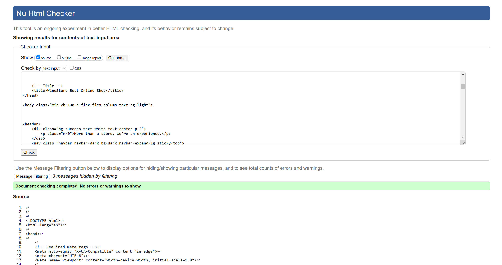
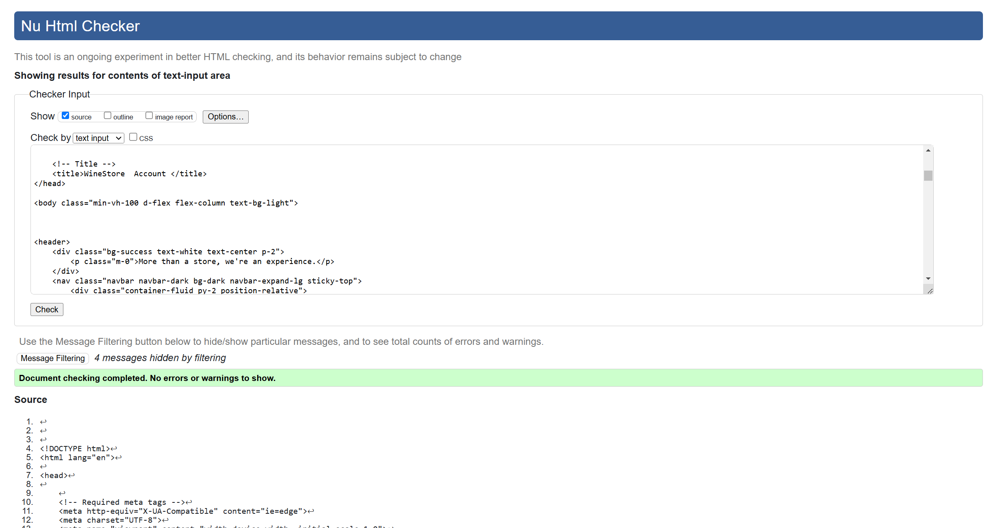
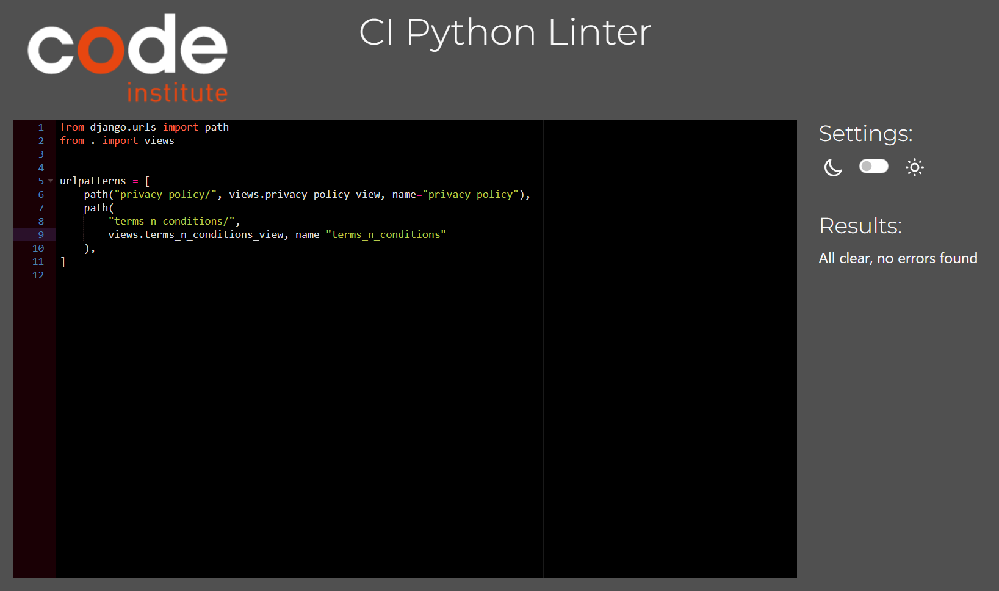

# Testing

# Contents

- [Testing](#testing)
- [Contents](#contents)
  - [Responsiveness Tests](#responsiveness-tests)
  - [Browser Compatibility](#browser-compatibility)
  - [Code Validation](#code-validation)
    - [HTML](#html)
    - [CSS](#css)
    - [JavaScript](#javascript)
    - [Python](#python)
  - [Lighthouse Testing](#lighthouse-testing)
  - [Accessibility Testing](#accessibility-testing)
  - [Manual Testing](#manual-testing)
  - [Role-based Restrictions](#role-based-restrictions)
  - [User Story Testing](#user-story-testing)
  - [Bugs](#bugs)

## Responsiveness Tests

The mobile-first strategy was used when developing the website. The project has been deployed at early stage to ensure best layout and effective testing. The DevTools were used during development and [Responsive Design Checker](https://responsivedesignchecker.com/ "Responsive Design Checker") along with [Am I Responsive](https://ui.dev/amiresponsive "Am I responsive") for testing.

| **Size** | **Device** | **Result** |
| --- | --- | :---: |
| 360 x 740  | Samsung Galaxy S8+ | ✅ |
| 414 x 896  | iPhone XR | ✅ |
| 430 x 932  | iPhone 14 Pro Max | ✅ |
| 768 x 1024  | iPad Mini | ✅ |
| 853 x 1280  | Asus Zenbook Fold | ✅ |
| 912 x 1368  | Surface Pro 7 | ✅ |
| 1024 x 1366  | iPad Pro |  ✅ |
| 1440 x 900  | Desktop | ✅ |
| 1680 x 1050  | Desktop | ✅ |
| 1920 x 1080  | Desktop | ✅ |

## Browser Compatibility

The deployed project was tested on the most popular browsers for compatibility issues.

| Browser | Notes | Result |
| --- | --- | :---: |
| Chrome | No issues identified | ✅ |
| Opera | No issues identified | ✅ |
| Firefox | No issues identified | ✅ |
| Microsoft Edge | No issues identified | ✅ |

## Code Validation

### HTML

The HTML files were validated using the recommended [HTML W3C Validator](https://validator.w3.org/#validate_by_input).

The process of HTML file validation by direct input:

1. Access the Validator: Visit the W3C Markup Validation Service.
2. Choose Direct Input: Select the "Validate by Direct Input" tab.
3. Paste Your HTML Code: Copy HTML code of the page from deployed website and paste it into the text box.
4. Validate: Click the "Check" button to validate HTML.

Notes:
- The source code for validation has been copied from the deployed version of the website, using "View source code" option.
- Every page extends from base.html and includes header.html and footer.html

HTML Validation Results

| **File name** | **Pass** | **Notes** | **Result** |
| --- | :---: | --- | --- |
| bag.html | ✅ | No errors or warnings to show |  |
| checkout.html | ✅ | No errors or warnings to show |  |
| checkout_success.html | ✅ | No errors or warnings to show |  |
| privacy_policy.html | ✅ | No errors or warnings to show |  |
| terms_n_conditions.html | ✅ | No errors or warnings to show |  |
| index.html | ✅ | No errors or warnings to show |  |
| products.html | ✅ | No errors or warnings to show |  |
| promotions.html | ✅ | No errors or warnings to show |  |
| search_results.html | ✅ | No errors or warnings to show |  |
| product_detail.html | ✅ | No errors or warnings to show |  |
| add_product.html | ✅ | No errors or warnings to show |  |
| edit_product.html | ✅ | No errors or warnings to show |  |
| profile.html | ✅ | No errors or warnings to show |  |
| wishlist.html | ✅ | No errors or warnings to show |  |

### CSS

The [W3C Jigsaw](https://jigsaw.w3.org/css-validator/#validate_by_input) tool, provided by the W3C, enables to validate and verify the correctness of CSS code. It ensures that your web pages adhere to W3C standards, promoting interoperability and accessibility.

CSS Validation Results

| **File name** | **Pass** | **Notes** | **Result** |
| --- | :---: | --- | --- |
| base.css | ✅ | No errors. Two warnings about "Same color for background-color and border-color" on *.custom-checkbox .custom-control-input:checked ~ .custom-control-label::before* and *#mc_embed_signup .button:hover*. This is a design feature. |  |
| profile.css | ✅ | No errors or warnings to show |  |
| checkout.css | ✅ | No errors or warnings to show. Except "-webkit-transition is a vendor extension" |  |

### JavaScript

No major errors were found when validating JavaScript through [Jshint](https://jshint.com/).

Jshint noted that bootstrap and tooltipList variables are undefined. This can be ignored because they rely on bootstrap javascript. STRIPE and Mailchimp scripts were obtained directly from the origins so no errors were taken into consideration in order to avoid interference with intended fuctionality.

<b>Test Results</b>

| **File name** | **Pass** | **Result** |
| --- | :---: | :---: |
| countryfiels.js | ✅ |  |
| tooltips and sortform in base.html | ✅ |  |
| update quantity and remove item on click in bag.html | ✅ |  |
| quantity_input_script.html | ✅ |  |

 

### Python

The python files have all been passed through [CI Python Linter](https://pep8ci.herokuapp.com/)

<b>Test Results</b>

| **File name** | **Pass** | **Result** |
| --- | :---: | :---: |
| **Bag App** |  |  |
| contexts.py | ✅ |  |
| urls.py | ✅ |  |
| views.py | ✅ |  |
| bag_tools.py | ✅ |  |
| **Checkout App** |  |  |
| admin.py | ✅ |  |
| forms.py | ✅ |  |
| models.py | ✅ |  |
| signals.py | ✅ |  |
| urls.py | ✅ |  |
| views.py | ✅ |  |
| webhook_handler.py | ✅ |  |
| webhooks.py | ✅ |  |
| **Customer_service App** |  |  |
| urls.py | ✅ |  |
| views.py | ✅ |  |
| **Home App** |  |  |
| urls.py | ✅ |  |
| views.py | ✅ |  |
| **Products App** |  |  |
| query_transform.py | ✅ |  |
| admin.py | ✅ |  |
| filters.py | ✅ |  |
| forms.py | ✅ |  |
| mixins.py | ✅ |  |
| models.py | ✅ |  |
| urls.py | ✅ |  |
| views.py | ✅ |  |
| widgets.py | ✅ |  |
| **Profiles App** |  |  |
| forms.py | ✅ |  |
| models.py | ✅ |  |
| urls.py | ✅ |  |
| views.py | ✅ |  |
| **Reviews App** |  |  |
| forms.py | ✅ |  |
| models.py | ✅ |  |
| urls.py | ✅ |  |
| views.py | ✅ |  |
| **Wine_store App** |  |  |
| settings.py | ✅ |  |
| urls.py | ✅ |  |
| views.py | ✅ |  |

 

## Lighthouse Testing

The website was tested in the [Chrome Dev Tools](https://developer.chrome.com/docs/devtools/) using Lighthouse Testing tool which inspects and scores the website for the following criteria:

* Performance - how quickly a website loads and how quickly users can access it.
* Accessibility - test analyses how well people who use assistive technologies can use your website.
* Best Practices - checks whether the page is built on the modern standards of web development.
* SEO - checks if the website is optimised for search engine result rankings.

<b>Test Results</b>

| **Page** | **Result** |
| --- | --- |
| Home |  |
| Products |  |
| Product detail |  |
| Promotions |  |
| Sign in |  |
| Sign up |  |
| Shopping bag |  |
| Privacy Policy |  |
| Terms & Conditions |  |
| Checkout |  |
| Checkout Success |  |
| Profile |  |
| Wishlist |  |
| Logout |  |

## Accessibility Testing

Besides Lighthouse accessibility testing, the website was also tested using the [WAVE](https://wave.webaim.org/) tool. No major errors identified. 
Unfortunately, it cannot evaluate the website from the registered user's view, due to login issues. Heroku app refused to connect.

There are several repeatable errors explained below:

| **Notes** | **Screenshot** |
| --- | --- |
| **1 X Missing form label** on the mailchimp subscription form. It is a neccessary hidden input and label is not required for the form to function. |  |
| **4 X Empty link** errors are due to usage of streched link class from bootstrap which uses position relative to connect the link to the container with product image. |  |
| **2 X Very low contrast** on asterisks on the mailchimp subscription form. They are red and visible on the dark background enough. |  |

Whenever there are product images on the page or footer with subscription form, these errors will popup. There are no other errors identified.

The testing results:

Home page

All products page

Red wine page

White wine page

Rosè wine page

Sparkling wine page

Promotions page

Sign up page

Sign in page

Product detail page

Shopping bag page

Privacy policy page

Terms & Conditions page

## Manual Testing

Extensive manual testing was performed on the application. Each feature was verified against success criteria. Where applicable, negative testing was conducted by providing invalid or unexpected inputs to assess the application's robustness in handling errors and exceptions.

<b>Header</b>

| **Test Case** | **Element** | **Action** | **Success Criteria** | **Result** |
| --- | --- | --- | --- | :---: |
| Logo link | Logo image | Click on the Logo | The user is navigated to the home page | ✅ |
| Home link | Home navigation item | Click on 'Home' | The user is navigated to the Home page | ✅ |
| Blog link | Blog navigation item | Click on 'Blog' | The user is navigated to the Blog page | ✅ |
| Add Post link | Add Post navigation item | Click on 'Add Post' | The logged in user is navigated to the Add Post page. While the visitor is asked to log in first, or sign up | ✅ |
| Register link | Register navigation item | Click on 'Register' | The user is navigated to the Signup page | ✅ |
| Login link | Login navigation item | Click on 'Login' | The user is navigated to the Login page | ✅ |
| Profile link | Profile navigation item | Click on 'Profile' | The user is navigated to his Profile page. The link is only available for registered users. Registered users can see each other's profiles. It is not restricted. More details in Feature Features section | ✅ |
| Logout link | Logout navigation item | Click on 'Logout' | The user is navigated to the Logout confirmation page. Only registered users can access Logout link | ✅ |

 

<b>Search bar</b>

| **Test Case** | **Element** | **Action** | **Success Criteria** | **Result** |
| --- | --- | --- | --- | :---: |
| Empty search | Search button | Click on 'Search' button | The user is navigated to the Blog page. Since the input was empty, all posts are displayed on the page | ✅ |
| Search available keyword | Search bar | Enter 'coffee', click on 'Search' button | The user is navigated to the Blog page. The posts, which include the keyword 'coffee' in either title, description or content are displayed on the page | ✅ |
| Search unavailable keyword | Search bar | Enter 'ndkghf', click on 'Search' button | The user is navigated to the Blog page. The message 'No matching results' is displayed on the page | ✅ |

 

<b>Footer</b>

| **Test Case** | **Element** | **Action** | **Success Criteria** | **Result** |
| --- | --- | --- | --- | :---: |
| LinkedIn link | LinkedIn icon | Click on 'LinkedIn' icon | The LinkedIn website is opened in a separate tab | ✅ |
| Facebook link | Facebook icon | Click on 'Facebook' icon | The Facebook website is opened in a separate tab | ✅ |
| Instagram link | Instagram icon | Click on 'Instagram' icon | The Instagram website is opened in a separate tab | ✅ |
| Twitter link | Twitter icon | Click on 'Twitter' icon | The Twitter website is opened in a separate tab | ✅ |
| YouTube link | YouTube icon | Click on 'YouTube' icon | The YouTube website is opened in a separate tab | ✅ |

 

<b>Home App</b>

| **Test Case** | **Element** | **Action** | **Success Criteria** | **Result** |
| --- | --- | --- | --- | :---: |
| Display hero image and welcome text | Home page | Navigate through Logo or 'Home' navigation item | The Home page displays the hero image with welcome text on it. The purpose of the website is clearly visible and the text is easy to read | ✅ |
| Display the latest posts (3) | 'Latest Posts' section | Navigate through Logo or 'Home' navigation item | Beneath the hero image the user can find three latest posts (published and approved posts only) | ✅ |
| View any latest post to read | Latest Post card | Click on the post card on the Home page | The user is navigated to the post detail view | ✅ |

 

<b>Blog App</b>

| **Test Case** | **Element** | **Action** | **Success Criteria** | **Result** |
| --- | --- | --- | --- | :---: |
| View paginated list of posts | Blog page | Navigate through 'Blog' navigation item | The approved and published posts are displayed by 6, with pagination. Sorted by the date | ✅ |
| View next page of posts | 'Next' button | Click on 'Next' button | The user is navigated to the next page | ✅ |
| View previous page of posts | 'Previous' button | Click on 'Previous' button | The user is navigated to the previous page | ✅ |
| View first page of posts | 'First' button | Click on 'First' button | The user is navigated to the first page | ✅ |
| View last page of posts | 'Last' button | Click on 'Last' button | The user is navigated to the last page | ✅ |
| View 2-nd page of posts | '2' page button | Click on '2' page button | The user is navigated to the 2-nd page | ✅ |
| View a post to read | Post card | Click on the post card | The user is navigated to the post detail view | ✅ |

 

<b>Post CRUD</b>

| **Test Case** | **Element** | **Action** | **Success Criteria** | **Result** |
| --- | --- | --- | --- | :---: |
| 'Add Post' link | 'Add Post' navigation item | Click on 'Add Post' | The user is navigated to the Add Post page with the form. Only registered users have access to the form | ✅ |
| 'Add Post' Form validation | 'Add Post' Form | Leave some fields empty | The error message is displayed. The user is asked to fill in the empty fields | ✅ |
| 'Create Post' Form action | 'Create Post' button in 'Add Post' Form | After filling out all the fields correctly, click on 'Create Post' button under the form | The user is navigated to the Blog page. The post has been created. If the Post status is 'published', then it is awaiting approval. The user can find it in his profile with the message 'awaiting approval' displayed. If the Post status is 'draft', it can be found in user profile for further editing | ✅ |
| 'Edit' link | 'Edit' button under the post | Click on 'Edit' button under your post | The user is navigated to the edit post view. Only the post author has access to the button and the form to edit the post | ✅ |
| 'Edit Post' Form validation | 'Edit Post' Form | Remove the text and leave some fields empty | The error message is displayed. The user is asked to fill in the empty fields | ✅ |
| 'Edit Post' Form action | 'Edit Post' button in 'Edit Post' Form | After editing the fields, click on 'Edit Post' button under the form | The user is navigated to the Blog page. The post has been updated. If the Post has been published and approved before, then it will be displayed on the Blog page with all other posts. If the Post status is 'published' but it was not previously approved, then it is awaiting approval. The user can find it in his profile with the message 'awaiting approval' displayed. If the Post status is 'draft', it can be found in user profile for further editing | ✅ |
| 'Delete' link | 'Delete' button under the post | Click on 'Delete' button under your post | The user is navigated to the delete post confirmation. Only the post author has access to the button and can confirm deletion | ✅ |
| Deletion confirmation | 'Confirm' button on delete post confirmation view | Click on 'Confirm' button | The user is navigated to the Blog page. The post has been successfully deleted from the database and is no longer displayed. Only the post author can confirm deletion | ✅ |
| Cancel post deletion | 'Cancel' button on delete post confirmation view | Click on 'Cancel' button | The user is navigated back to the post detail page. The post has not been deleted | ✅ |

 

<b>Comments section</b>

| **Test Case** | **Element** | **Action** | **Success Criteria** | **Result** |
| --- | --- | --- | --- | :---: |
| View post comments | Comments section | Click on post card, scroll down to the comments section | The comments are displayed. Only approved comments are visible for all users. Not approved comments are visible to the comment author | ✅ |
| 'Add Comment' link | 'Add Comment' button in comments section | Click on 'Add Comment' | The modal with form is displayed to the user. Only registered users have access to the button and form | ✅ |
| 'Add Comment' Form validation | 'Add Comment' Form | Leave empty | The error message is displayed. The user is asked to fill in the empty field | ✅ |
| 'Add Comment' Form action | 'Save changes' button in 'Add Comment' Form | After inputting some text, click on 'Save changes' button | The user is navigated to the post detail page he commented. The comment has been created. It is awaiting approval. The proper message is displayed | ✅ |
| 'Delete' link | 'Delete' icon at top right corner of the comment | Click on 'Delete' icon on your comment | The user is navigated to the delete comment confirmation. Only the comment author has access to the button | ✅ |
| Deletion confirmation | 'Confirm' button on delete comment confirmation view | Click on 'Confirm' button | The user is navigated to the Blog page. The comment has been successfully deleted from the database and is no longer displayed. Only the comment author can confirm deletion | ✅ |
| Cancel comment deletion | 'Cancel' button on delete comment confirmation view | Click on 'Cancel' button | The user is navigated back to the post detail page. The comment has not been deleted | ✅ |

 

<b>Profile App</b>

| **Test Case** | **Element** | **Action** | **Success Criteria** | **Result** |
| --- | --- | --- | --- | :---: |
| View my profile | Profile page | Navigate through 'Profile' navigation item | The profile is displayed with picture, username, date joined, amount of posts and bio if available. Only registered users can view each other's profile | ✅ |
| 'Edit' profile | 'Edit' button under the profile | Click on 'Edit' button under your profile | The modal is displayed with a form to update a profile picture and bio. The bio can be left blank. The avatar can be either changed or unchanged (the default image will be displayed). Only the profile's owner has access to the button and the form to edit it | ✅ |
| 'Edit profile' Form action | 'Save changes' button in 'Edit profile' Form | After updating bio or changing the picture, click on 'Save changes' button under the form | The user is navigated to his profile. The profile has been successfully updated. Only the profile's owner can update his profile | ✅ |
| Cancel the editing | 'Close' button in 'Edit profile' form | Click on 'Close' button | The user is navigated back to the profile. The profile has not been updated | ✅ |
| View my posts | Profile page | Navigate through 'Profile' navigation item | Beneath the profile, the user's posts can be found, including the title, description and creation date. Only the post author can see drafts and unapproved posts. Other registered users can see only approved and published posts | ✅ |
| View my post to edit or delete it | Post card in profile | Click on post card in your profile | The user is navigated to the post detail view. The post author can access edit and delete buttons to work on the post.  | ✅ |

 

## Role-based Restrictions

The user role based restrictions were tested to ensure that view and functionality reflects the scope of the project.

- ### **Admin**

| **Functionality** | **Result** |
| --- | :---: |
| Full access to all resources and features | ✅ |
| CRUD on all elements | ✅ |
| Manage user roles and restrictions | ✅ |
| Access to admin dashboard and settings | ✅ |

- ### **Registered User**

| **Functionality** | **Result** |
| --- | :---: |
| CRUD on their own content (post) | ✅ |
| No access to change another user's content | ✅ |
| Create and delete comments | ✅ |
| Update profile | ✅ |
| Read all published and approved posts | ✅ |
| Read all approved comments | ✅ |
| View another user's profile (if shared a link) | ✅ |

- ### **Visitor**

| **Functionality** | **Result** |
| --- | :---: |
| View published and approved content (post) | ✅ |
| No CRUD on any elements | ✅ |
| No access to view another user's profile | ✅ |

## User Story Testing

- ### **Developer User Stories**

| **User Story** | **Notes** | **Acceptance Criteria Complete** |
| --- | --- | :---: |
| [Agile Methodology](https://github.com/VL-ocean/coffee-choco-prj/issues/36) | Documented in README.md, section [Agile Development Tool](https://github.com/VL-ocean/coffee-choco-prj#agile-development-tool) | ✅ |
| [Design Database Schema](https://github.com/VL-ocean/coffee-choco-prj/issues/37) | Documented in README.md, section [Structure & Logical Flow](https://github.com/VL-ocean/coffee-choco-prj#structure--logical-flow) | ✅ |
| [Design](https://github.com/VL-ocean/coffee-choco-prj/issues/39) | Documented in README.md, section [UX Design](https://github.com/VL-ocean/coffee-choco-prj?tab=readme-ov-file#ux-design) | ✅ |
| [Create wireframes](https://github.com/VL-ocean/coffee-choco-prj/issues/38) | Documented in README.md, section [Wireframe](https://github.com/VL-ocean/coffee-choco-prj#wireframe) | ✅ |
| [Create Django Project](https://github.com/VL-ocean/coffee-choco-prj/issues/40) | Git commit [025e597](https://github.com/VL-ocean/coffee-choco-prj/commit/025e597f5c0c674f28bffdce01c5cb0efd4968bf) | ✅ |
| [Initial Deployment to Heroku](https://github.com/VL-ocean/coffee-choco-prj/issues/41) | Git commit [d3c49de](https://github.com/VL-ocean/coffee-choco-prj/commit/d3c49de5da7d0fbaa31e5acf6b05414f54618266) | ✅ |
| [Performance Optimization](https://github.com/VL-ocean/coffee-choco-prj/issues/42) | Completed during development | ✅ |
| [Code Validation](https://github.com/VL-ocean/coffee-choco-prj/issues/43) | Documented in TESTING.md, section [Code Validation](https://github.com/VL-ocean/coffee-choco-prj/blob/main/TESTING.md#code-validation) | ✅ |
| [Performance and Accessibility Testing](https://github.com/VL-ocean/coffee-choco-prj/issues/44) | Documented in TESTING.md, section [Lighthouse Testing](https://github.com/VL-ocean/coffee-choco-prj/blob/main/TESTING.md#lighthouse-testing) and [Accessibility Testing](https://github.com/VL-ocean/coffee-choco-prj/blob/main/TESTING.md#accessibility-testing) | ✅ |
| [User Story Testing](https://github.com/VL-ocean/coffee-choco-prj/issues/46) | Documented in TESTING.md, section [User Story Testing](https://github.com/VL-ocean/coffee-choco-prj/blob/main/TESTING.md#user-story-testing) | ✅ |
| [Final Heroku Deployment](https://github.com/VL-ocean/coffee-choco-prj/issues/45) | Git commit [cd8ce2d](https://github.com/VL-ocean/coffee-choco-prj/commit/cd8ce2d9e1ad450c403b08fe72aa31dddc263fcb) | ✅ |
| [Comprehensive Project Documentation](https://github.com/VL-ocean/coffee-choco-prj/issues/47) | Comprehensive [README.md](https://github.com/VL-ocean/coffee-choco-prj/blob/main/README.md) and [TESTING.md](https://github.com/VL-ocean/coffee-choco-prj/blob/main/TESTING.md) | ✅ |

- ### **Visitor User Stories**

| **User Story** | **Notes** | **Acceptance Criteria Complete** |
| --- | --- | :---: |
| [View Home page](https://github.com/VL-ocean/coffee-choco-prj/issues/1) | Git commit [283d410](https://github.com/VL-ocean/coffee-choco-prj/commit/283d4103d359362307b1a1c310f19e0268f18181) | ✅ |
| [Sign Up feature](https://github.com/VL-ocean/coffee-choco-prj/issues/5) | Git commit [5272dbe](https://github.com/VL-ocean/coffee-choco-prj/commit/5272dbeddb9389abcb43899e51b0861f7e14255e) | ✅ |
| [View blog posts (paginated)](https://github.com/VL-ocean/coffee-choco-prj/issues/3) | Git commit [0968a62](https://github.com/VL-ocean/coffee-choco-prj/commit/0968a62296f5ca45efcf085c72f8c988e999ea10) | ✅ |
| [View latest posts on home page](https://github.com/VL-ocean/coffee-choco-prj/issues/2) | Git commit [283d410](https://github.com/VL-ocean/coffee-choco-prj/commit/283d4103d359362307b1a1c310f19e0268f18181) | ✅ |

- ### **Registered user User Stories**

| **User Story** | **Notes** | **Acceptance Criteria Complete** |
| --- | --- | :---: |
| [Login and Logout Features](https://github.com/VL-ocean/coffee-choco-prj/issues/6) | Git commit [5272dbe](https://github.com/VL-ocean/coffee-choco-prj/commit/5272dbeddb9389abcb43899e51b0861f7e14255e) | ✅ |
| [View blog posts (paginated)](https://github.com/VL-ocean/coffee-choco-prj/issues/3) | Git commit [0968a62](https://github.com/VL-ocean/coffee-choco-prj/commit/0968a62296f5ca45efcf085c72f8c988e999ea10) | ✅ |
| [View latest posts on home page](https://github.com/VL-ocean/coffee-choco-prj/issues/2) | Git commit [283d410](https://github.com/VL-ocean/coffee-choco-prj/commit/283d4103d359362307b1a1c310f19e0268f18181) | ✅ |
| [Create a recipe/article](https://github.com/VL-ocean/coffee-choco-prj/issues/18) | Git commit [faa091b](https://github.com/VL-ocean/coffee-choco-prj/commit/faa091b1cdf105a2dbea2d74e7db7e201726cce1) | ✅ |
| [Update my recipe/article](https://github.com/VL-ocean/coffee-choco-prj/issues/19) | Git commit [eec45ea](https://github.com/VL-ocean/coffee-choco-prj/commit/eec45ea97054f227eef7c73d900487492a6f6420) | ✅ |
| [Delete my recipe/article](https://github.com/VL-ocean/coffee-choco-prj/issues/21) | Git commit [4219837](https://github.com/VL-ocean/coffee-choco-prj/commit/4219837db4e89511934a618815f566b5b2d15997) | ✅ |
| [View my posts in my profile](https://github.com/VL-ocean/coffee-choco-prj/issues/28) | Git commit [8bbee41](https://github.com/VL-ocean/coffee-choco-prj/commit/8bbee4118cfa7cbf22a9a78a3c6b1ea96ed5ccaf#diff-48fde33dc780b3ac8ed737a0b65e3257ff526510e7ec5a7755ac04208bccb6d5) | ✅ |
| [Fill out / Update profile info](https://github.com/VL-ocean/coffee-choco-prj/issues/25) | Git commit [922402d](https://github.com/VL-ocean/coffee-choco-prj/commit/922402df8a94e93e90e58f81cd49d624c04734d6#diff-24d82cf2552dbb8559c90d6d4f0481d348c26a9ab90ef850c18af2b87e5098b1) | ✅ |
| [Add comment](https://github.com/VL-ocean/coffee-choco-prj/issues/13) | Git commit [b1ee1c4](https://github.com/VL-ocean/coffee-choco-prj/commit/b1ee1c465c8d06e298b16ae8687be6e243909b22) | ✅ |
| [Delete comment](https://github.com/VL-ocean/coffee-choco-prj/issues/16) | Git commit [7e06c84](https://github.com/VL-ocean/coffee-choco-prj/commit/7e06c843217010bb177b9cba97b415d825a5d62f) | ✅ |

- ### **Site Admin User Stories**

| **User Story** | **Notes** | **Acceptance Criteria Complete** |
| --- | --- | :---: |
| [Manage posts in admin panel](https://github.com/VL-ocean/coffee-choco-prj/issues/31) | Git commit [2b69960](https://github.com/VL-ocean/coffee-choco-prj/commit/2b699600c51aeddf0b4fdf571a913c554d3aa75d) | ✅ |
| [Admin can delete user and their profile](https://github.com/VL-ocean/coffee-choco-prj/issues/34) | Git commit [922402d](https://github.com/VL-ocean/coffee-choco-prj/commit/922402df8a94e93e90e58f81cd49d624c04734d6#diff-a58172ae21173b7558fc0c745dd69b2abf2c2359635dbd32f6aecb74e6c6874c) | ✅ |

## Bugs

| **Description** | **Solution** | **Status** | **Notes** |
| --- | --- | :---: | --- |
| 'Profile' navigation item does not become active when the Profile page is opened | In header.html use 'request.resolver_match.url_name' to compare the opened url with the url name in [profiles/urls.py]. Once it matches, the active class is applied to the navigation item | ✅ | Resolved with git commit beb22da |
| When searching a word that is not found in any blog posts, the posts.html renders the title 'Newst Posts' with no posts in it. It does not indicate that the match was not found | In posts.html added if statement to check whether 'posts' variable has anything inside. If it is empty, then the message 'No matching results' is displayed to the user | ✅ | Resolved with git commit beb22da |
| 'Add Comment' Form can be submitted empty | In post_detail.html add 'required' attribute to the textarea of the comment body. So that the form cannot be submitted empty on the frontend | ✅ | Resolved with git commit ff9ee1b |
| Console error displayed by CKE Editor. Due to it being no longer supported by the developers |The solution is to buy and use their secured and supported 5-th version of the Editor. Or replace it with another free editor | ❌ | Due to resolve in future fixes |
| Modal popup displayed by CKE Editor in the forms where the widget was used. Due to it being no longer supported by the developers | The solution is to buy and use their secured and supported 5-th version of the Editor. Or replace it with another free editor | ✅ | Temporary fix by setting display to none using custom JavaScript |
| The if statement for `updated` date in post_detail.html does not work as intended. It is supposed to be displayed only if the post has been updated after creation. However it is displayed despite the statement. The post approvement is currently considered as update too, which should not be the case | The solution is to redo the logic. Perhaps move the `approved` status to a separate database table | ❌ | Due to resolve in future fixes |