# Testing

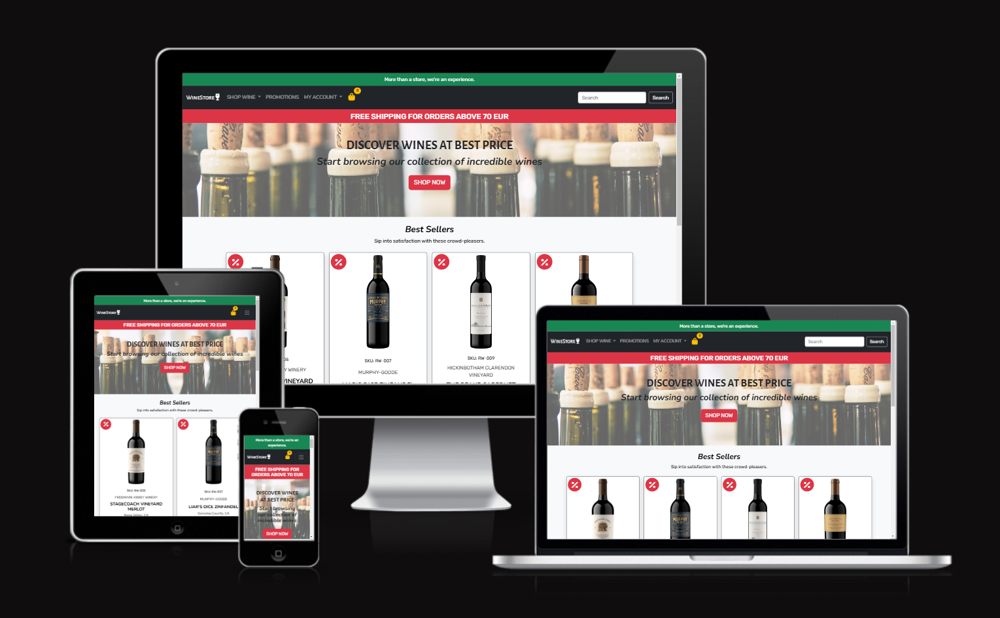

# Contents

- [Testing](#testing)
- [Contents](#contents)
  - [Responsiveness Tests](#responsiveness-tests)
  - [Browser Compatibility](#browser-compatibility)
  - [Code Validation](#code-validation)
    - [HTML](#html)
    - [CSS](#css)
    - [JavaScript](#javascript)
    - [Python](#python)
  - [Lighthouse Testing](#lighthouse-testing)
  - [Accessibility Testing](#accessibility-testing)
  - [Manual Testing](#manual-testing)
  - [Role-based Restrictions](#role-based-restrictions)
  - [User Story Testing](#user-story-testing)
  - [Bugs](#bugs)

## Responsiveness Tests

The mobile-first strategy was used when developing the website. The project has been deployed at early stage to ensure best layout and effective testing. The DevTools were used during development and [Responsive Design Checker](https://responsivedesignchecker.com/ "Responsive Design Checker") along with [Am I Responsive](https://ui.dev/amiresponsive "Am I responsive") for testing.

| **Size** | **Device** | **Result** |
| --- | --- | :---: |
| 360 x 740  | Samsung Galaxy S8+ | ✅ |
| 414 x 896  | iPhone XR | ✅ |
| 430 x 932  | iPhone 14 Pro Max | ✅ |
| 768 x 1024  | iPad Mini | ✅ |
| 853 x 1280  | Asus Zenbook Fold | ✅ |
| 912 x 1368  | Surface Pro 7 | ✅ |
| 1024 x 1366  | iPad Pro |  ✅ |
| 1440 x 900  | Desktop | ✅ |
| 1680 x 1050  | Desktop | ✅ |
| 1920 x 1080  | Desktop | ✅ |

[Back to top](#contents)

## Browser Compatibility

The deployed project was tested on the most popular browsers for compatibility issues.

| Browser | Notes | Result |
| --- | --- | :---: |
| Chrome | No issues identified | ✅ |
| Opera | No issues identified | ✅ |
| Firefox | No issues identified | ✅ |
| Microsoft Edge | No issues identified | ✅ |

[Back to top](#contents)

## Code Validation

### HTML

The HTML files were validated using the recommended [HTML W3C Validator](https://validator.w3.org/#validate_by_input).

The process of HTML file validation by direct input:

1. Access the Validator: Visit the W3C Markup Validation Service.
2. Choose Direct Input: Select the "Validate by Direct Input" tab.
3. Paste Your HTML Code: Copy HTML code of the page from deployed website and paste it into the text box.
4. Validate: Click the "Check" button to validate HTML.

Notes:
- The source code for validation has been copied from the deployed version of the website, using "View source code" option.
- Every page extends from base.html and includes header.html and footer.html

HTML Validation Results

| **File name** | **Pass** | **Notes** | **Result** |
| --- | :---: | --- | --- |
| bag.html | ✅ | No errors or warnings to show |  |
| checkout.html | ✅ | No errors or warnings to show |  |
| checkout_success.html | ✅ | No errors or warnings to show |  |
| privacy_policy.html | ✅ | No errors or warnings to show |  |
| terms_n_conditions.html | ✅ | No errors or warnings to show |  |
| index.html | ✅ | No errors or warnings to show |  |
| products.html | ✅ | No errors or warnings to show |  |
| promotions.html | ✅ | No errors or warnings to show |  |
| search_results.html | ✅ | No errors or warnings to show |  |
| product_detail.html | ✅ | No errors or warnings to show |  |
| add_product.html | ✅ | No errors or warnings to show |  |
| edit_product.html | ✅ | No errors or warnings to show |  |
| profile.html | ✅ | No errors or warnings to show |  |
| wishlist.html | ✅ | No errors or warnings to show |  |

### CSS

The [W3C Jigsaw](https://jigsaw.w3.org/css-validator/#validate_by_input) tool, provided by the W3C, enables to validate and verify the correctness of CSS code. It ensures that your web pages adhere to W3C standards, promoting interoperability and accessibility.

CSS Validation Results

| **File name** | **Pass** | **Notes** | **Result** |
| --- | :---: | --- | --- |
| base.css | ✅ | No errors. Two warnings about "Same color for background-color and border-color" on *.custom-checkbox .custom-control-input:checked ~ .custom-control-label::before* and *#mc_embed_signup .button:hover*. This is a design feature. |  |
| profile.css | ✅ | No errors or warnings to show |  |
| checkout.css | ✅ | No errors or warnings to show. Except "-webkit-transition is a vendor extension" |  |

### JavaScript

No major errors were found when validating JavaScript through [Jshint](https://jshint.com/).

Jshint noted that bootstrap and tooltipList variables are undefined. This can be ignored because they rely on bootstrap javascript. STRIPE and Mailchimp scripts were obtained directly from the origins so no errors were taken into consideration in order to avoid interference with intended fuctionality.

<b>Test Results</b>

| **File name** | **Pass** | **Result** |
| --- | :---: | :---: |
| countryfiels.js | ✅ |  |
| tooltips and sortform in base.html | ✅ |  |
| update quantity and remove item on click in bag.html | ✅ |  |
| quantity_input_script.html | ✅ |  |

 

### Python

The python files have all been passed through [CI Python Linter](https://pep8ci.herokuapp.com/)

<b>Test Results</b>

| **File name** | **Pass** | **Result** |
| --- | :---: | :---: |
| **Bag App** |  |  |
| contexts.py | ✅ |  |
| urls.py | ✅ |  |
| views.py | ✅ |  |
| bag_tools.py | ✅ |  |
| **Checkout App** |  |  |
| admin.py | ✅ |  |
| forms.py | ✅ |  |
| models.py | ✅ |  |
| signals.py | ✅ |  |
| urls.py | ✅ |  |
| views.py | ✅ |  |
| webhook_handler.py | ✅ |  |
| webhooks.py | ✅ |  |
| **Customer_service App** |  |  |
| urls.py | ✅ |  |
| views.py | ✅ |  |
| **Home App** |  |  |
| urls.py | ✅ |  |
| views.py | ✅ |  |
| **Products App** |  |  |
| query_transform.py | ✅ |  |
| admin.py | ✅ |  |
| filters.py | ✅ |  |
| forms.py | ✅ |  |
| mixins.py | ✅ |  |
| models.py | ✅ |  |
| urls.py | ✅ |  |
| views.py | ✅ |  |
| widgets.py | ✅ |  |
| **Profiles App** |  |  |
| forms.py | ✅ |  |
| models.py | ✅ |  |
| urls.py | ✅ |  |
| views.py | ✅ |  |
| **Reviews App** |  |  |
| forms.py | ✅ |  |
| models.py | ✅ |  |
| urls.py | ✅ |  |
| views.py | ✅ |  |
| **Wine_store App** |  |  |
| settings.py | ✅ |  |
| urls.py | ✅ |  |
| views.py | ✅ |  |

 

[Back to top](#contents)

## Lighthouse Testing

The website was tested in the [Chrome Dev Tools](https://developer.chrome.com/docs/devtools/) using Lighthouse Testing tool which inspects and scores the website for the following criteria:

* Performance - how quickly a website loads and how quickly users can access it.
* Accessibility - test analyses how well people who use assistive technologies can use your website.
* Best Practices - checks whether the page is built on the modern standards of web development.
* SEO - checks if the website is optimised for search engine result rankings.

<b>Test Results</b>

| **Page** | **Result** |
| --- | --- |
| Home |  |
| Products |  |
| Product detail |  |
| Promotions |  |
| Sign in |  |
| Sign up |  |
| Shopping bag |  |
| Privacy Policy |  |
| Terms & Conditions |  |
| Checkout |  |
| Checkout Success |  |
| Profile |  |
| Wishlist |  |
| Logout |  |

[Back to top](#contents)

## Accessibility Testing

Besides Lighthouse accessibility testing, the website was also tested using the [WAVE](https://wave.webaim.org/) tool. No major errors identified. 
Unfortunately, it cannot evaluate the website from the registered user's view, due to login issues. Heroku app refused to connect.

There are several repeatable errors explained below:

| **Notes** | **Screenshot** |
| --- | --- |
| **1 X Missing form label** on the mailchimp subscription form. It is a neccessary hidden input and label is not required for the form to function. |  |
| **4 X Empty link** errors are due to usage of streched link class from bootstrap which uses position relative to connect the link to the container with product image. |  |
| **2 X Very low contrast** on asterisks on the mailchimp subscription form. They are red and visible on the dark background enough. | 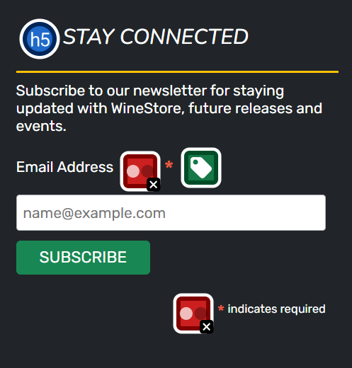 |

Whenever there are product images on the page or footer with subscription form, these errors will popup. There are no other errors identified.

The testing results:

Home page

All products page

Red wine page

White wine page

Rosè wine page

Sparkling wine page

Promotions page

Sign up page

Sign in page

Product detail page

Shopping bag page

Privacy policy page

Terms & Conditions page

[Back to top](#contents)

## Manual Testing

Extensive manual testing was performed on the application. Each feature was verified against success criteria. Where applicable, negative testing was conducted by providing invalid or unexpected inputs to assess the application's robustness in handling errors and exceptions.

<b>AUTHENTICATION</b>

| **Test Case** | **Element** | **Action** | **Expected Outcome** | **Result** |
| --- | --- | --- | --- | :---: |
| Register with Valid Credentials | Registration form fields | Fill out the form with valid credentials and submit. | User is redirected to the home page after successful registration and signed in. | ✅ |
| Register with Blank Fields | Registration form fields | Leave one or all required fields blank and submit the form. | Registration fails with appropriate error messages for each blank field. User remains on the registration page. | ✅ |
| Login with Valid Credentials | Login form fields | Fill out the form with valid email address/username and password and submit. | User is redirected to the home page after successful login. Success message displayed. | ✅ |
| Login with Invalid email address/username | Login form fields | Attempt to login with an invalid email address/username. | Login fails with appropriate error message ("Please enter a correct email address and password"). User remains on the login page. | ✅ |
| Login with Incorrect Password | Login form fields | Attempt to login with a valid email address / username but incorrect password. | Login fails with appropriate error message ("Please enter a correct email address and password"). User remains on the login page. | ✅ |
| Login with Blank Fields | Login form fields | Leave email address / username or password field blank and submit the form. | Login fails with appropriate error messages for each blank field. User remains on the login page. | ✅ |
| Logout | Logout link or button | Click on the logout link/button while authenticated. | User is logged out and redirected to the home page. Navigation bar updates to reflect non-authenticated state (e.g., "Login" and "Register" links). Log out notification displayed. | ✅ |

 

<b>REVIEWS</b>

| **Test Case** | **Element** | **Action** | **Expected Outcome** | **Result** |
| --- | --- | --- | --- | :---: |
| Display reviews | Reviews container | View existing reviews | All reviews associated with the post are displayed, showing author's email address and creation time. | ✅ |
| Display Review Timestamp | Review timestamp | View review creation time | Review creation time is displayed in a human-readable format (e.g., "2 days ago"). | ✅ |
| Edit review (Owner or Superuser) | Edit button | Click on edit button | Redirects to edit review page if user is review owner or superuser. | ✅ |
| Delete review (Owner or Superuser) | Delete button | Click on delete button | Shows delete confirmation modal and deletes review if user confirms action. | ✅ |
| No reviews Available | "No reviews yet" message | No reviews exist for the post  | Message "No reviews yet." is displayed. | ✅ |
| Submit review | Review form | Enter review and submit | review is successfully added and displayed in the reviews section. | ✅ |
| Authenticate review Submission| "Add a review as *username*" message | User is authenticated | Shows message "Add a review as *username*" above the review form. | ✅ |
| Display Login Prompt | "Sign in" link | User is not authenticated | Shows link "Sign in to leave a review" prompting user to log in. | ✅ |
| Form Validation Error | Submit button | Submit empty or invalid review | Displays error messages next to form fields, prompting user to correct them. | ✅ |
| Buyer reviews | Review Container | Add Review | Container not available if the product has not been purchased by the user unless the user is a superuser. | ✅ |

 

<b>ALL PRODUCTS</b>

| **Test Case** | **Element** | **Action** | **Expected Outcome** | **Result** |
| --- | --- | --- | --- | :---: |
| Toggle Filter | ToggleButton (Filter) | Click the toggle button | Filter options should expand/collapse | ✅ |
| Filter by Category | Category Checkbox | Select one or more categories | Products should be filtered by selected categories | ✅ |
| Filter by Variety | Variety Checkbox | Select one or more varieties| Products should be filtered by selected varieties | ✅ |
| Filter by Vintage | Vintage Checkbox | Select one or more vintage | Products should be filtered by selected vintage | ✅ |
| Filter by Country | Country Checkbox | Select one or more countries | Products should be filtered by selected countries | ✅ |
| Filter by Brand | Brand Checkbox | Select one or more brands| Products should be filtered by selected brands | ✅ |
| Filter by Bottle Size | Bottle Size Checkbox | Select one or more bottle sizes | Products should be filtered by selected bottle sizes | ✅ |
| Filter by Price Range | Price Range Checkbox | Select a price range | Products should be filtered by selected price range | ✅ |
| Sort by Price (low to high) | Sort Dropdown | Select 'Price (low to high)' and submit | Products should be sorted by Price in ascending order | ✅ |
| Sort by Price (high to low) | Sort Dropdown | Select 'Price (high to low)' and submit | Products should be sorted by Price in descending order | ✅ |
| Sort by Name (A to Z) | Sort Dropdown | Select 'Name (A to Z)' and submit | Products should be sorted by Name in ascending order | ✅ |
| Sort by Name (Z to A) | Sort Dropdown | Select 'Name (Z to A)' and submit | Products should be sorted by Name in descending order | ✅ |
| View a product | Product image | Click on product image | The user is navigated to the product detail view | ✅ |

 

<b>PRODUCT DETAIL</b>

| **Test Case** | **Element** | **Action** | **Expected Outcome** | **Result** |
| --- | --- | --- | --- | :---: |
| Add Product to Wishlist | Heart Plus icon | Click on the icon | The product is added to the user's wishlist. Success message displayed to the user | ✅ |
| Remove Product from Wishlist | Heart Minus icon | Click on the icon | The product is removed from user's wishlist. Success message displayed to the user | ✅ |
| Add Product to Cart | Add to Cart Button | Click on the 'Add to Cart' button | The product is added to the shopping cart. Success message displayed to the user | ✅ |

 

<b>PROMOTIONS</b>

| **Test Case** | **Element** | **Action** | **Expected Outcome** | **Result** |
| --- | --- | --- | --- | :---: |
| Sort by Price (low to high) | Sort Dropdown | Select 'Price (low to high)' and submit | Products should be sorted by Price in ascending order | ✅ |
| Sort by Price (high to low) | Sort Dropdown | Select 'Price (high to low)' and submit | Products should be sorted by Price in descending order | ✅ |
| Sort by Name (A to Z) | Sort Dropdown | Select 'Name (A to Z)' and submit | Products should be sorted by Name in ascending order | ✅ |
| Sort by Name (Z to A) | Sort Dropdown | Select 'Name (Z to A)' and submit | Products should be sorted by Name in descending order | ✅ |
| View a product | Product image | Click on product image | The user is navigated to the product detail view | ✅ |

 

<b>SHOPPING BAG</b>

| **Test Case** | **Element** | **Action** | **Expected Outcome** | **Result** |
| --- | --- | --- | --- | :---: |
| Display Product in Cart | Product Image and description | View the product image and description in the cart | Product details should be displayed correctly in the cart | ✅ |
| Update Quantity | Quantity Selector | Change the quantity value and submit | The quantity should update and reflect in the total price | ✅ |
| Decrease Quantity | Decrement Button | Click the decrement button to reduce quantity | The quantity should decrease and update the total price | ✅ |
| Increase Quantity | Increment Button | Click the increment button to increase quantity | The quantity should increase and update the total price | ✅ |
| Remove Product from Cart | Remove Button | Click the remove button to delete the product | The product should be removed from the cart and the cart total should update | ✅ |
| Checkout Process | Checkout Button | Click the 'Secure Checkout' button | User should be redirected to the checkout page | ✅ |
| Display Order Summary | Order Summary  | View the total price in the order summary | Order summary should be displayed correctly | ✅ |
| Verify Total Price with Shipping | Order Total | Verify total price calculation with shipping costs | Total price should include product price and shipping cost | ✅ |
| Update Quantity with Invalid Number (Failure) | Quantity Input Field | Enter a negative or zero value and submit | An error message should be displayed, and quantity should not update | ✅ |

 

<b>CHECKOUT</b>

| **Test Case** | **Element** | **Action** | **Expected Outcome** | **Result** |
| --- | --- | --- | --- | :---: |
| Verify Total Price | Order Total | Check if total price matches product price and shipping cost | Total price should include item price and delivery fee | ✅ |
| Fill out Delivery Information | Delivery Information Form | Fill in all required delivery information fields | Delivery information should be validated and accepted | ✅ |
| Complete Payment | Payment Form | Enter payment details and submit the form | Payment should be processed successfully, and the order completed | ✅ |
| Proceed to Checkout | Checkout Button | Click the 'Complete Order' button to proceed | User should be redirected to the confirmation page | ✅ |
| Save Delivery Information | Save Info Checkbox | Select the checkbox to save delivery information to profile | Delivery information should be saved to the user's profile | ✅ |
| Missing Required Fields in Delivery Info (Failure) | Delivery Information Form | Leave required fields (e.g., Full Name, Email) empty | An error message should appear, indicating missing fields | ✅ |
| Invalid Payment Details (Failure) | Payment Details Field | Enter invalid or incomplete payment information | Payment should be rejected, and an error message should be displayed | ✅ |

 

<b>PROFILE</b>

| **Test Case** | **Element** | **Action** | **Expected Outcome** | **Result** |
| --- | --- | --- | --- | :---: |
| Update Shipping Information | Profile form| Enter shipping address and submit | Information is successfully updated. | ✅ |
| View Items in Wishlist | Wishlist navingation item | Click on Wishlist menu item | The products added to the wishlist are displayed. | ✅ |
| View order history | Visit My Profile page | Click on My Profile menu item | The orders history is displayed. | ✅ |
| View past order confirmation | Order number link | Click on order number | User redirected to past order confirmation page. | ✅ |

 

<b>PRODUCT MANAGEMENT</b>

| **Test Case** | **Element** | **Action** | **Expected Outcome** | **Result** |
| --- | --- | --- | --- | :---: |
| Add a product | Add product form | Fill out necessary information, then submit | The product is successfully added and displayed on All Products page. | ✅ |
| Edit a product | Edit product form | Click on Edit button, change the product description/price etc, then submit | The product is successfully updated. The changes are displayed right away in product description. | ✅ |
| Delete a product | Delete button | Click on Delete button | The product is successfully deleted. | ✅ |

 

<b>HEADER</b>

| **Test Case** | **Element** | **Action** | **Expected Outcome** | **Result** |
| --- | --- | --- | --- | :---: |
| Verify Page Logo Navigation| Logo | Click on the logo | Navigates to the homepage | ✅ |
| Verify Shop Wine Dropdown | Shop Wine Dropdown | Click on the Shop Wine dropdown | Dropdown menu is displayed | ✅ |
| Verify Red Wine Navigation | Red Wine link | Click on the Red Wine link | Navigates to the page filtered by Red Wine category | ✅ |
| Verify White Wine Navigation | White Wine link | Click on the White Wine link | Navigates to the page filtered by White Wine category | ✅ |
| Verify Rosè Wine Navigation | Rosè Wine link | Click on the Rosè Wine link | Navigates to the page filtered by Rosè Wine category | ✅ |
| Verify Sparkling Wine Navigation | Sparkling Wine link | Click on the Sparkling Wine link | Navigates to the page filtered by Sparkling Wine category | ✅ |
| Verify All Wine Navigation | All Wine link | Click on the All Wine link | Navigates to the all products page | ✅ |
| Verify Promotions Navigation | Promotions link | Click on the Promotions link | Navigates to the Promotions page | ✅ |
| Verify My Account Dropdown | My Account Dropdown | Click on the My Account dropdown | Dropdown menu is displayed | ✅ |
| Verify Product Management Navigation | Product Management link | Click on the Product Management link | Navigates to the Add Product page | ✅ |
| Verify My Profile Navigation | My Profile link | Click on the My Profile link | Navigates to the My Profile page | ✅ |
| Verify Wishlist Navigation | Wishlist link | Click on the wishlist link | Navigates to the wishlist page | ✅ |
| Verify Shopping Bag Navigation | Shopping Bag Icon | Click on the Shopping Bag icon | Navigates to the Shopping Bag page | ✅ |
| Verify Register Navigation | Register link | Click on the Register link | Navigates to the Sign up page | ✅ |
| Verify Login Navigation | Login link | Click on the Login link | Navigates to the Sign in page | ✅ |
| Verify Logout Functionality | Logout Link | Click on 'Logout' | Logs out the user | ✅ |
| Verify Main Navigation Bar | Main Navigation Bar | View navigation bar | Navigation bar is displayed with correct links | ✅ |
| Verify Navbar Toggle in Mobile View | Navbar Toggle | Click on the navbar toggle button in mobile view | Expands the navigation bar | ✅ |
| Search available keyword | Search form | Enter keyword and submit | Search results should be filtered by the specified keyword | ✅ |
| Empty search | Search form | Click on 'Search' button | User redirected to all products page. Message displayed "No keywords entered" | ✅ |
| Search unavailable keyword | Search form | Enter a very long string or special characters, then submit | Message displayed "No products found matching your criteria" | ✅ |

 

<b>FOOTER</b>

| **Test Case** | **Element** | **Action** | **Expected Outcome** | **Result** |
| --- | --- | --- | --- | :---: |
| Test Contact Us Section Visibility | Contact Us Section | Verify the visibility of the text and social links | The text and social links should be visible and readable | ✅ |
| Test Social Media Links Functionality | Social Media Links | Click each social media link (Facebook, Instagram, Twitter) and verify they open correctly | Each social media link should open the correct platform | ✅ |
| Test Our Location Section Visibility | Our Location Section | Verify the visibility of the text | The text should be visible and readable | ✅ |
| Test Helpful Links Navigation | Helpful Links | Click each link (Privacy Policy, Terms and Conditions) and check navigation | User should be navigated to the correct pages for each link | ✅ |
| Test Newsletter Subscription Input | Newsletter Email Input | Enter email address in the input box | User should be able to enter an email address | ✅ |
| Test Newsletter Subscription Button | Newsletter Subscription Button | Click the 'Subscribe' button after entering an email | Button click should trigger a subscription process | ✅ |
| Test Newsletter Error Response for Invalid Email | Newsletter Subscription Error | Enter an invalid email and click the 'Subscribe' button | User should see an error message about invalid email | ✅ |
| Test Newsletter Success Response for Valid Email | Newsletter Subscription Success | Enter a valid email and click the 'Subscribe' button | User should see a success message confirming subscription | ✅ |

 

<b>LANDING PAGE</b>

| **Test Case** | **Element** | **Action** | **Expected Outcome** | **Result** |
| --- | --- | --- | --- | :---: |
| Verify Hero Title Display | Hero Title h1 | Check if title is displayed correctly | Title is displayed on the page | ✅ |
| Verify Hero Subtitle Display | Hero Subtitle h2 | Check if subtitle is displayed | Subtitle is visible | ✅ |
| Verify Shop Now Navigation | Shop Now button | Click on the Shop Now button | Navigates to the All Products page | ✅ |
| Hero Image Display | Hero Image| Check if hero image loads | Hero image is displayed correctly on the page | ✅ |
| Best Sellers Section Display | Best Sellers Wines | Check if products are displayed | Products are shown under 'Best Sellers' section and discount icon is present | ✅ |
| Verify See More Navigation | See More button | Click on the See More button | Navigates to the Promotions page | ✅ |
| Verify Four Reasons Section Display | Four Reasons section | Check if title and text are displayed correctly | All text is visible and readable | ✅ |

 

[Back to top](#contents)

## Role-based Restrictions

The user role based restrictions were tested to ensure that view and functionality reflects the scope of the project.

- ### **Admin**

| **Functionality** | **Result** |
| --- | :---: |
| Full access to all resources and features | ✅ |
| CRUD on all elements | ✅ |
| Manage user roles and restrictions | ✅ |
| Access to admin dashboard and settings | ✅ |
| Can view all users data | ✅ |

- ### **Registered User**

| **Functionality** | **Result** |
| --- | :---: |
| CRUD on their own content | ✅ |
| Cannot manage content created by other users | ✅ |
| Can update profile information | ✅ |
| Can purchase products | ✅ |
| Can manage their own wishlist | ✅ |

- ### **Visitor**

| **Functionality** | **Result** |
| --- | :---: |
| Can purchase products | ✅ |
| No access to profile | ✅ |
| Cannot manage reviews and wishlist | ✅ |

[Back to top](#contents)

## User Story Testing

- ### **Developer User Stories**

| **User Story** | **Notes** | **Acceptance Criteria Complete** |
| --- | --- | :---: |
| [USER STORY: Agile Methodology](https://github.com/VL-ocean/winery/issues/1) | Documented in README.md | ✅ |
| [USER STORY: Design Database Schema](https://github.com/VL-ocean/winery/issues/2) | Database design documented in README.md | ✅ |
| [USER STORY: Design Website Visuals](https://github.com/VL-ocean/winery/issues/3) | Design process documented in README.md | ✅ |
| [USER STORY: Create Wireframes](https://github.com/VL-ocean/winery/issues/4) | Wireframes documented in README.md | ✅ |
| [USER STORY: Create Django Project](https://github.com/VL-ocean/winery/issues/5) | Git Commit [bab6420](https://github.com/VL-ocean/winery/commit/bab64203e39896f496a71e9c28d5130cb8e4845c) | ✅ |
| [USER STORY: Visual Consistency](https://github.com/VL-ocean/winery/issues/29) | Summary documented in README.md | ✅ |
| [USER STORY: Accessibility Enhancement](https://github.com/VL-ocean/winery/issues/30) | Test results documented in TESTING.md | ✅ |
| [USER STORY: Performance Optimization](https://github.com/VL-ocean/winery/issues/31) | Results documented in TESTING.md | ✅ |
| [USER STORY: Facebook Marketing](https://github.com/VL-ocean/winery/issues/33) | Results documented in TESTING.md | ✅ |
| [USER STORY: SEO](https://github.com/VL-ocean/winery/issues/34) | Results documented in TESTING.md | ✅ |
| [USER STORY: Code Validation](https://github.com/VL-ocean/winery/issues/37) | Results documented in TESTING.md | ✅ |
| [USER STORY: Performance and Accessibility Testing](https://github.com/VL-ocean/winery/issues/38) | Results documented in TESTING.md | ✅ |
| [USER STORY: User Story Testing](https://github.com/VL-ocean/winery/issues/39) | Results documented in TESTING.md | ✅ |
| [USER STORY: Heroku Deployment](https://github.com/VL-ocean/winery/issues/40) | Git Commit [a14ba35](https://github.com/VL-ocean/winery/commit/a14ba3564989a181cd257b03efd65172928b720f#diff-cba54f701a90997acc9d40d073c290f580fe8994c14ee905bc7188dddcd4652e) | ✅ |
| [USER STORY: Comprehensive Project Documentation](https://github.com/VL-ocean/winery/issues/41) | Comprehensive README.md and TESTING.md | ✅ |

- ### **Visitor User Stories**

| **User Story** | **Notes** | **Acceptance Criteria Complete** |
| --- | --- | :---: |
| [USER STORY: User Registration](https://github.com/VL-ocean/winery/issues/7) | 

Screenshot
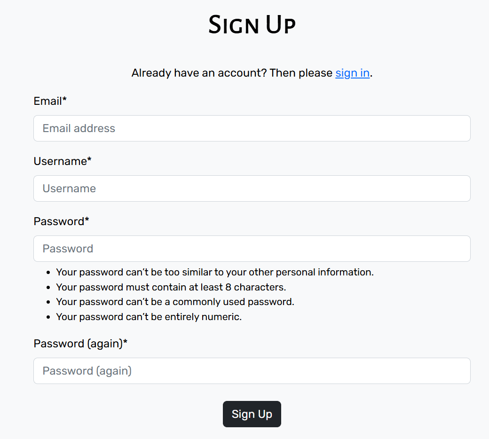
 | ✅ |
| [Implement Navigation Experience](https://github.com/VL-ocean/winery/issues/28) | Summary documented in README.md | ✅ |
| [USER STORY: Newsletter Subscription](https://github.com/VL-ocean/winery/issues/35) | 

Screenshot
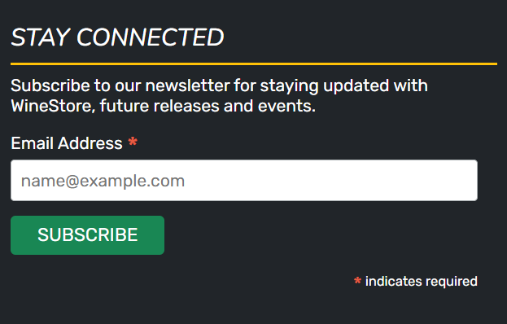
 | ✅ |

- ### **Registered user User Stories**

| **User Story** | **Notes** | **Acceptance Criteria Complete** |
| --- | --- | :---: |
| [USER STORY: User Login and Logout Features](https://github.com/VL-ocean/winery/issues/8) | 

Screenshot
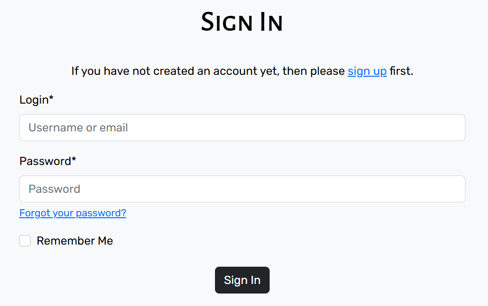
 | ✅ |
| [USER STORY: Profile Management](https://github.com/VL-ocean/winery/issues/10) | 

Screenshot
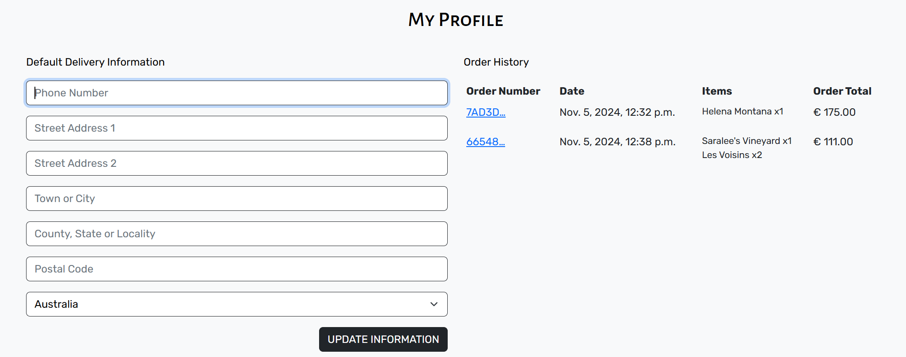
 | ✅ |

- ### **Customer User Stories**

| **User Story** | **Notes** | **Acceptance Criteria Complete** |
| --- | --- | :---: |
| [USER STORY: Simplify Product Selection](https://github.com/VL-ocean/winery/issues/17) | 

Screenshot
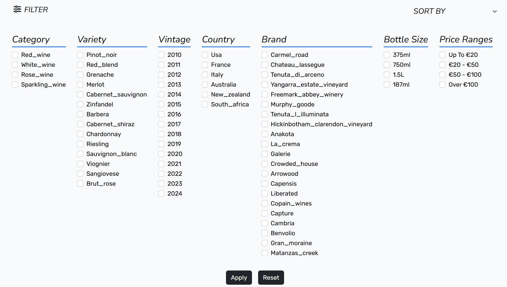
 | ✅ |
| [USER STORY: Streamline Adding Products to Cart](https://github.com/VL-ocean/winery/issues/18) | 

Screenshot
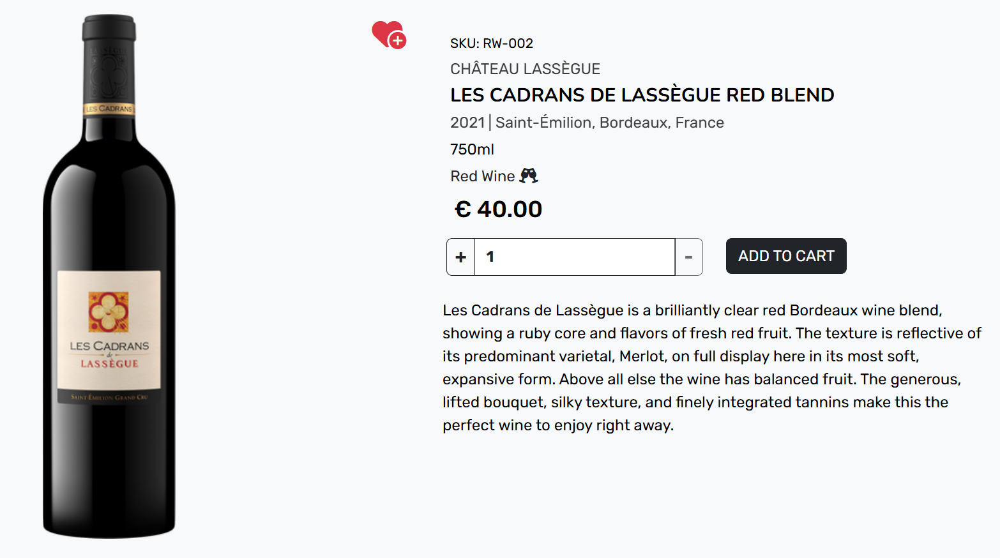
 | ✅ |
| [USER STORY: Secure and Efficient Checkout](https://github.com/VL-ocean/winery/issues/19) | 

Screenshot
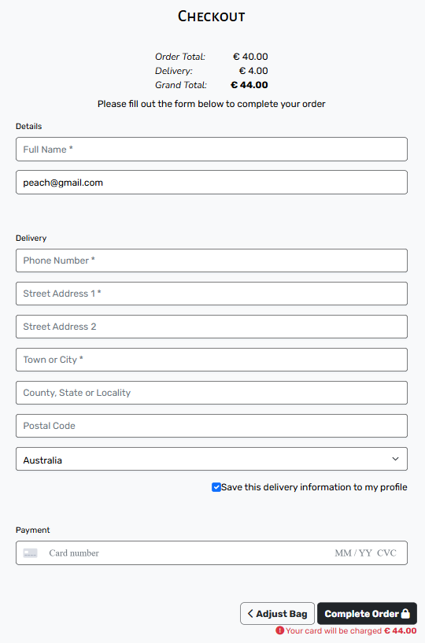
 | ✅ |

- ### **Registered Customer User Stories**

| **User Story** | **Notes** | **Acceptance Criteria Complete** |
| --- | --- | :---: |
| [USER STORY: Integrate User Account Features into the Checkout Process](https://github.com/VL-ocean/winery/issues/20) | 

Screenshot
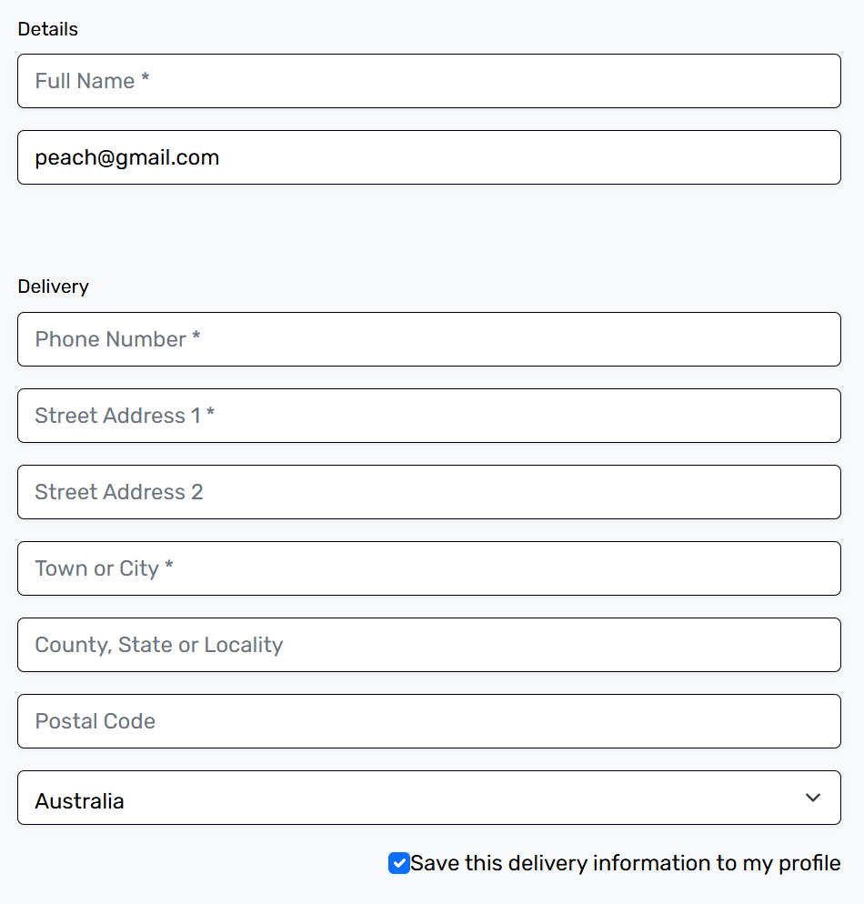
 | ✅ |
| [USER STORY: Product rating](https://github.com/VL-ocean/winery/issues/23) | 

Screenshot
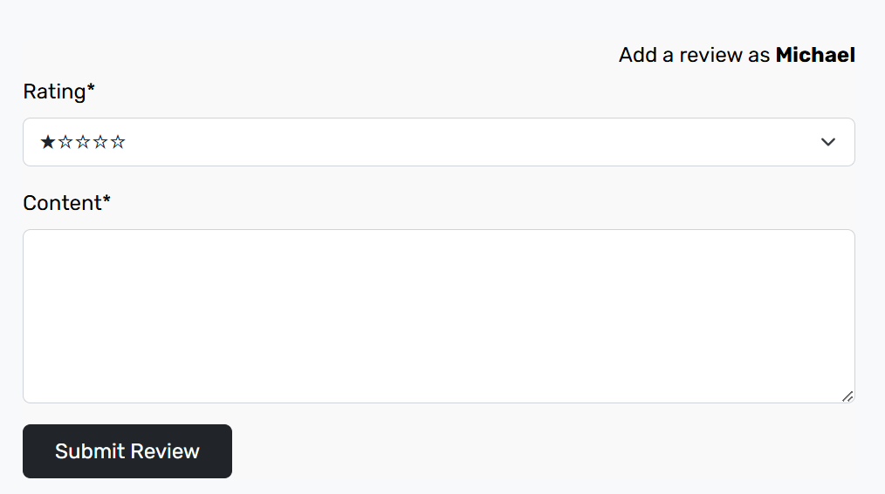
 | ✅ |
| [USER STORY: Wishlist](https://github.com/VL-ocean/winery/issues/24) | 

Screenshot
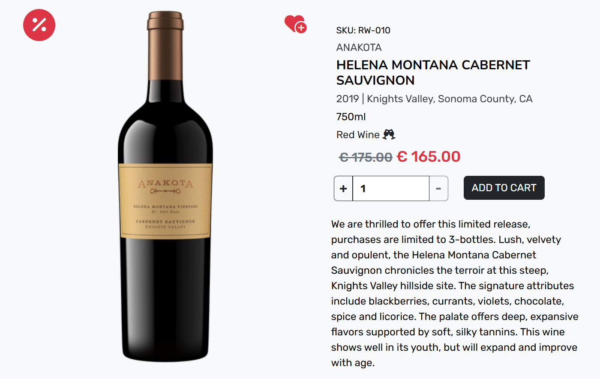
 | ✅ |
| [USER STORY: Add a Review](https://github.com/VL-ocean/winery/issues/25) | 

Screenshot
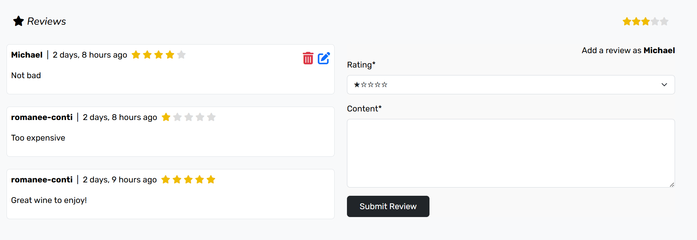
 | ✅ |
| [USER STORY: Manage Reviews](https://github.com/VL-ocean/winery/issues/26) | 

Screenshot
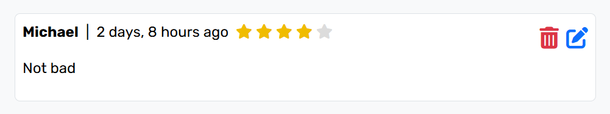
 | ✅ |

- ### **Site Admin User Stories**

| **User Story** | **Notes** | **Acceptance Criteria Complete** |
| --- | --- | :---: |
| [USER STORY: Add Products to the Store](https://github.com/VL-ocean/winery/issues/12) | 

Screenshot
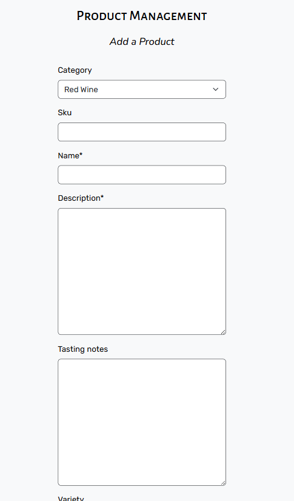
 | ✅ |
| [USER STORY: Update Product Details in the Store](https://github.com/VL-ocean/winery/issues/13) | 

Screenshot
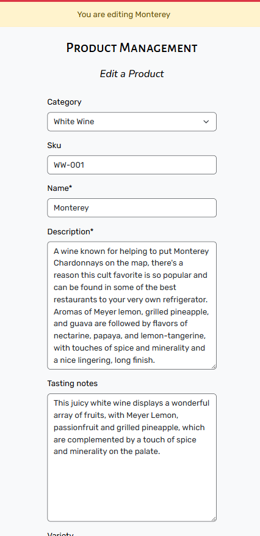
 | ✅ |
| [USER STORY: Delete Products from the Store](https://github.com/VL-ocean/winery/issues/14) | 

Screenshot
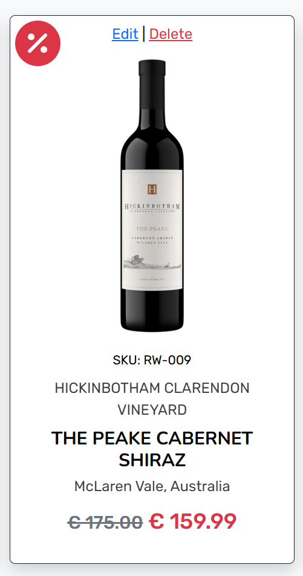
 | ✅ |
| [USER STORY: Administration Content CRUD](https://github.com/VL-ocean/winery/issues/15) | Admin Panel | ✅ |

[Back to top](#contents)

## Bugs

| **Description** | **Status** | **Notes** |
| --- | :---: | --- |
| Console error from MailChimp: "mc-validate.js:195 Uncaught TypeError: Cannot read properties of undefined (reading 'replace'), at Object.getAjaxSubmitUrl (mc-validate.js:195:14), at mc-validate.js:351:11, at mc-validate.js:373:2" | ❌ | Due to resolve in future fixes |
| Console error due to Sort form "Uncaught TypeError: Cannot read properties of null (reading 'addEventListener'), at (index):532:46". The javascript function for sort form should be moved into a separate file and connected to the template when the sort form is used | ❌ | Due to resolve in future fixes |
| Checkbox labels in Filter form are displaying model names instead of their friendly names | ❌ | Due to resolve in future fixes |
| Filter form and Sort form are not available on all pages with products | ❌ | Due to resolve in future fixes |
| Search form performs search only on Product model, the foreing models are not available yet. Need to update search form criteria | ❌ | Due to resolve in future fixes |
| No phone number validation on forms | ❌ | Due to resolve in future fixes |

[Back to top](#contents)